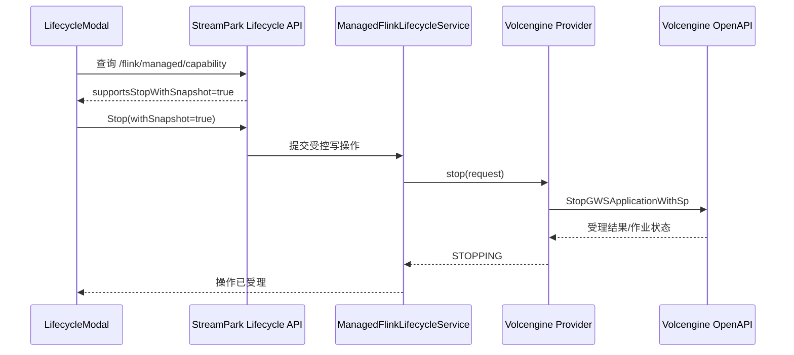

# Volcengine Managed Flink 代码审核说明

> 面向基线提交 `2e9b4a8e32c6ebdabb745f250049104019cfb0f9` 及其后 Managed Flink 多云环境模型重构的人工 Review 指南。

| 项目 | 内容 |
| --- | --- |
| 分支 | `codex/managed-flink-volcengine` |
| 基线提交 | `[Console] Complete Volcengine managed Flink workflows` |
| 后续变更 | Managed Environment 改为通用 provider config；Volcengine 的 Project、Resource Pool、Draft Directory、TOS bucket 收敛到供应商配置 |
| 主要范围 | 多云环境模型、Volcengine Managed Flink SQL/JAR 发布、依赖上传、Stop with Savepoint、实时能力查询、相关前端交互 |
| 建议审核时长 | 快速审核 30～45 分钟；完整审核 60～90 分钟 |
| 文档生成日期 | 2026-08-06 |

## 1. 审核结论摘要

本次变更补齐了 Volcengine Managed Flink 的两类主要使用链路：

1. Managed Flink SQL 和 JAR 作业都可以选择依赖 JAR；JAR 作业可以选择主程序 JAR，并携带 `MainClass` 和运行参数进行 Release。
2. 本地资源在 Release 前上传到 TOS，再注册为火山 Flink 文件资源，最终以火山侧文件资源 ID 写入作业草稿。
3. 停止作业时支持调用火山 `StopGWSApplicationWithSp`，在停止过程中创建 Savepoint。
4. 前端不再只依赖环境创建时保存的 capability 快照，而是在生命周期操作弹窗打开时查询实时 capability。
5. `ManagedFlinkEnvironment`、`ProviderContext` 和操作快照不再直接声明火山专属字段，为后续 AWS、阿里云 Provider 留出独立配置空间。

从实现完整度看，核心代码路径和定向测试已经具备，适合进入人工 Review 和测试环境验收；在合并前仍建议重点确认以下四项：

- 火山文件管理接口、用户配置的 Flink TOS bucket 及其写权限是否与生产账号配置一致。
- JAR 草稿更新中的 `Jar`、`ResourceVersion`、`Dependency` 字段语义是否与火山 OpenAPI 完全一致。
- `StopGWSApplicationWithSp` 的请求与返回结构在不同作业状态下是否稳定。
- 现有状态同步测试仍有 1 个失败用例，需要判断是本次行为变更后应更新断言，还是 Flink Web UI URL 同步出现了回归。

## 2. 建议的快速审核顺序

如果审核时间有限，建议按以下顺序阅读：

1. 用 5 分钟阅读本文第 3～5 节，理解目标和调用链。
2. 用 15 分钟审核 [VolcengineManagedFlinkProvider.java](../../streampark-console/streampark-console-service/src/main/java/org/apache/streampark/console/core/managed/provider/volcengine/VolcengineManagedFlinkProvider.java)，重点搜索 `stageArtifact`、`upsertDraft`、`stopWithSnapshot`。
3. 用 10 分钟审核 [ManagedFlinkReleaseServiceImpl.java](../../streampark-console/streampark-console-service/src/main/java/org/apache/streampark/console/core/managed/service/ManagedFlinkReleaseServiceImpl.java) 和 [ManagedFlinkArtifactServiceImpl.java](../../streampark-console/streampark-console-service/src/main/java/org/apache/streampark/console/core/managed/service/ManagedFlinkArtifactServiceImpl.java)。
4. 用 10 分钟审核 [ManagedApplicationForm.vue](../../streampark-console/streampark-console-webapp/src/views/flink/app/components/ManagedFlink/ManagedApplicationForm.vue)、[ManagedDependencyUpload.vue](../../streampark-console/streampark-console-webapp/src/views/flink/app/components/ManagedFlink/ManagedDependencyUpload.vue) 和 [LifecycleModal.vue](../../streampark-console/streampark-console-webapp/src/views/flink/app/components/ManagedFlink/LifecycleModal.vue)。
5. 最后执行第 10 节的 P0 验收用例，并记录签署结果。

## 3. 变更目标与非目标

### 3.1 本次目标

- 支持 Managed Flink SQL 作业引用上传到火山 Flink 文件管理的依赖 JAR。
- 支持 Managed Flink JAR 作业选择主程序 JAR、配置入口类和参数，并完成 Release。
- 修正火山草稿更新请求体，使其保留服务端草稿字段及 `ResourceVersion`。
- 支持停止作业时创建 Savepoint。
- 让前端基于实时 provider capability 决定是否展示对应操作。
- 统一 Managed Application 与现有 Flink SQL 编辑器的主要视觉和交互。
- 将 Managed Environment 的供应商专属字段迁移到带版本号的 `providerConfigJson`，由对应 Provider 解析和校验。

### 3.2 非目标

- 不改变 Standalone Flink 的发布和依赖管理流程。
- 不引入新的数据库表；仅调整 `t_managed_flink_env` 的供应商配置列及已有 3.0.0 建表脚本。
- 不修改鉴权模型、团队权限模型或用户凭证保存方式。
- 不提供云端作业删除/下线能力。
- 不实现 Managed SQL 的独立 Verify；该交互已按产品反馈撤回。

## 4. 端到端架构和调用链

### 4.1 Release 主链路


关键约束：

- 主程序 JAR 与依赖 JAR 是两种用途，不能混入同一个字段。
- Release Snapshot 只保存资源映射结果，不保存 AK/SK 或临时访问凭证。
- 对可能产生副作用的云端写请求不自动重试，避免首次成功但响应丢失后重复创建。

### 4.2 Stop with Savepoint 链路



普通 Stop 仍调用原有实例取消接口；只有 `withSnapshot=true` 时走 `StopGWSApplicationWithSp`。

## 5. 关键数据契约

### 5.1 JAR 草稿更新请求

当前实现期望向火山草稿更新接口提交类似以下结构：

```json
{
  "Id": "<provider-draft-id>",
  "JobType": "FLINK_STREAMING_JAR",
  "ProjectId": "<project-id>",
  "JobName": "<job-name>",
  "ResourceVersion": "<provider-current-resource-version>",
  "Options": "{}",
  "DynamicOptions": "{...}",
  "EngineVersion": "FLINK_VERSION_1_17",
  "DirectoryId": "<draft-directory-id>",
  "Jar": "<provider-main-jar-file-resource-id>",
  "MainClass": "com.example.Main",
  "Args": "--key value",
  "Dependency": "{\"jars\":[\"<dependency-file-resource-id>\"],\"dependencyVersions\":{...}}"
}
```

审核时必须确认：

- `Jar` 是火山 Flink 文件管理资源 ID，不是 StreamPark resource ID、TOS URI 或文件名。
- `ResourceVersion` 来自当前云端草稿，不是主 JAR 的资源版本。
- JAR 作业移除 `SqlText`；SQL 作业移除 `Jar`、`MainClass`、`Args`。
- 更新请求基于云端草稿深拷贝后覆盖，避免遗漏 `AccountId`、`UserId`、`Platform` 等火山侧必需字段。
- 当无依赖时，`Dependency` 保持为 `{"jars":[]}`，而不是 `null`。

### 5.2 主 JAR 与依赖 JAR 映射

| StreamPark 输入 | 云端处理 | 草稿字段 |
| --- | --- | --- |
| Application JAR | 上传 TOS并注册文件资源 | `Jar` |
| SQL/JAR Dependency | 上传 TOS并注册文件资源 | `Dependency.jars[]` |
| Main Class | 原样写入 | `MainClass` |
| Program Args | 空值归一为空字符串 | `Args` |

主 JAR 会从依赖列表中排除，避免同一个 JAR 同时作为主程序和依赖重复绑定。

### 5.3 文件暂存规则

- TOS object key 使用内容寻址路径：`__artifacts/{projectId}/resources/{checksum}/{fileName}`。
- 用户在创建或编辑 Managed Environment/Cluster 时必须显式填写 Flink TOS bucket。
- Artifact staging 只使用作业所属 Managed Environment 保存的 bucket，不从已有资源 URI 推导，也不调用 IAM `GetUser` 自动拼接。
- 上传成功后，在火山 Flink 文件管理中创建或复用 `streampark-managed` 目录，并注册文件元数据。
- 重复内容通过 checksum/文件资源查询尽量复用，减少重复上传和注册。

现有 Managed Environment 升级后没有 bucket 值时，必须先在 Cluster 编辑页面补充配置，才能再次暂存或发布新 artifact。

### 5.4 多云环境配置边界

共享环境模型仅保存以下通用信息：

- Provider 类型、云账号、Region。
- `providerConfigJson`：供应商自行定义的配置载荷。
- `providerConfigVersion`：配置结构版本，用于后续兼容迁移。
- capability、探测状态和通用控制台地址。

Volcengine 的配置由 `VolcengineEnvironmentConfig` 强类型承载，包括 Project、Resource Pool、Draft Directory 和 TOS bucket。创建或更新环境时，通用 Service 只负责保存配置；Volcengine Provider 负责解析、版本检查及远端资源有效性校验。Release、Start/Stop、Savepoint、Artifact staging 和 Reconcile 均通过不可变操作快照携带通用配置 JSON，避免执行期间读取到已被修改的环境配置。

审核时重点确认：

- [ ] 通用 entity、API request、operation snapshot 中没有重新出现火山专属字段。
- [ ] Provider 配置版本不支持、JSON 非法或必填字段缺失时，在执行云端写操作前失败。
- [ ] 新增其他云 Provider 时可以定义独立配置类和前端表单，而无需扩展 `ManagedFlinkEnvironment` 数据列。
- [ ] 配置 JSON 和操作快照不包含 AK/SK、临时 Token 等凭证。

## 6. 后端变更说明

### 6.1 Provider 层

主要文件：[VolcengineManagedFlinkProvider.java](../../streampark-console/streampark-console-service/src/main/java/org/apache/streampark/console/core/managed/provider/volcengine/VolcengineManagedFlinkProvider.java)

主要变化：

- `supportsJarDirectUpload` 从 `false` 改为 `true`。
- `supportsStopWithSnapshot` 从 `false` 改为 `true`。
- 实现 TOS 上传、文件目录管理、文件资源注册与结果查询。
- JAR 草稿更新支持 `Jar`、`MainClass`、`Args`。
- Stop with Savepoint 通过 Action `StopGWSApplicationWithSp`、Version `2021-06-01` 调用。
- 作业详情补充实时实例查询、Flink Web UI URL 和 Provider Console URL 组装。

重点审核点：

- [ ] 所有 provider 写操作都经过 managed write admission，未绕过互斥和 unknown outcome 保护。
- [ ] 文件注册发生超时但云端成功时，后续 reconcile 能找到并复用已创建资源。
- [ ] Stop with Savepoint 返回缺少 `Success` 字段时是否应按成功受理处理。
- [ ] `ClusterId`、`GtsJobUuid`、`AppId` 的 URL 参数分别使用了正确 ID。
- [ ] 最新实例选择不会把已停止的旧实例错误识别为当前运行实例。

### 6.2 OpenAPI 与签名

主要文件：

- [VolcengineOpenApiClient.java](../../streampark-console/streampark-console-service/src/main/java/org/apache/streampark/console/core/managed/provider/volcengine/VolcengineOpenApiClient.java)
- [VolcengineRequestSigner.java](../../streampark-console/streampark-console-service/src/main/java/org/apache/streampark/console/core/managed/provider/volcengine/VolcengineRequestSigner.java)

主要变化：

- 签名器支持按 `flink` 或 `iam` service 生成 credential scope 和 signing key。
- 文件暂存不再依赖 IAM `GetUser`；OpenAPI client 仅访问显式配置且经过校验的 Flink endpoint。
- 读取请求允许有限重试；副作用写请求使用 `postOnce`，不做透明重试。

重点审核点：

- [ ] AK 只用于签名和必要请求字段，不进入异常消息、日志、Release Snapshot 或数据库非加密字段。
- [ ] endpoint 白名单可阻止配置被利用进行任意目标请求。
- [ ] TOS 或文件管理权限不足时，错误能映射为 `AUTHORIZATION`，而不是模糊的 internal error。

### 6.3 Release 与 Artifact Service

主要文件：

- [ManagedFlinkReleaseServiceImpl.java](../../streampark-console/streampark-console-service/src/main/java/org/apache/streampark/console/core/managed/service/ManagedFlinkReleaseServiceImpl.java)
- [ManagedFlinkArtifactServiceImpl.java](../../streampark-console/streampark-console-service/src/main/java/org/apache/streampark/console/core/managed/service/ManagedFlinkArtifactServiceImpl.java)
- [ManagedFlinkReleaseExecutor.java](../../streampark-console/streampark-console-service/src/main/java/org/apache/streampark/console/core/managed/service/ManagedFlinkReleaseExecutor.java)

主要变化：

- Release 从仅支持 SQL 扩展为支持 SQL 与 JAR。
- SQL 仍要求存在 SQL candidate；JAR 要求存在主程序资源和 Main Class。
- SQL 与 JAR 均可以暂存依赖 JAR。
- Artifact Service 使用 provider 的实时 capability，避免旧环境 capability 快照阻止新能力。
- Release Snapshot 新增 `jar`、`mainClass`、`args`，Executor 将其传给 provider。

重点审核点：

- [ ] Application JAR 必须同时满足 `ResourceType.APP` 和 `EngineType.FLINK`。
- [ ] 资源在数据库中存在但本地文件已丢失时，能在调用云端前给出明确错误。
- [ ] 暂存多个文件时部分成功、部分失败不会产生无法识别的错误绑定。
- [ ] Snapshot 中只有 provider 文件 ID，不包含本地绝对路径、AK/SK 或临时 token。

### 6.4 Application 校验

主要文件：

- [ManagedFlinkApplicationServiceImpl.java](../../streampark-console/streampark-console-service/src/main/java/org/apache/streampark/console/core/managed/service/ManagedFlinkApplicationServiceImpl.java)
- [ManagedFlinkApplicationValidator.java](../../streampark-console/streampark-console-service/src/main/java/org/apache/streampark/console/core/managed/service/ManagedFlinkApplicationValidator.java)

行为变化：

- 允许 SQL 作业配置 JAR dependencies。
- JAR 作业保存时验证主程序资源类型和引擎类型。
- SQL 与 JAR 保存时都检查所引用 dependency resource 是否存在。

## 7. 前端变更说明

### 7.1 Managed Application 表单

主要文件：[ManagedApplicationForm.vue](../../streampark-console/streampark-console-webapp/src/views/flink/app/components/ManagedFlink/ManagedApplicationForm.vue)

- Job Type 使用统一 Select 和 SQL/JAR 图标显示，修复编辑态两个选项同时显示的问题。
- Managed SQL 复用现有 [FlinkSql.vue](../../streampark-console/streampark-console-webapp/src/views/flink/app/components/FlinkSql.vue) 编辑器。
- Managed 模式隐藏 Verify 和 Preview，避免必须先 Release 才能校验的割裂体验。
- Application JAR 下拉框只展示 Flink APP 类型资源。
- SQL 和 JAR 均展示 dependency 选择控件。

### 7.2 Dependency 上传

新增文件：[ManagedDependencyUpload.vue](../../streampark-console/streampark-console-webapp/src/views/flink/app/components/ManagedFlink/ManagedDependencyUpload.vue)

上传步骤：

1. 校验扩展名必须是 `.jar`。
2. 检查当前资源列表中的同名文件。
3. 使用现有资源上传 API 上传文件。
4. 调用资源检查接口。
5. 创建 `JAR_LIBRARY + FLINK` 类型的 StreamPark resource 记录。
6. 将新资源加入 Managed Application 的 dependency 选择结果。

重点审核点：

- [ ] 上传成功但资源记录创建失败时，是否需要提示存在孤儿文件或提供清理能力。
- [ ] 同名不同内容 JAR 的处理符合产品预期。
- [ ] 上传过程中按钮禁用、错误提示和重复提交保护正确。
- [ ] 编辑已有应用时，资源列表回显不会丢失已选择 dependency。

### 7.3 Lifecycle capability

主要文件：[LifecycleModal.vue](../../streampark-console/streampark-console-webapp/src/views/flink/app/components/ManagedFlink/LifecycleModal.vue)

- 打开生命周期弹窗时调用 `/flink/managed/capability` 获取实时 provider capability。
- 实时查询失败时回退到环境中持久化的 `capabilityJson`。
- 该逻辑用于解决旧环境保存了 `supportsStopWithSnapshot=false`，升级后仍错误禁用功能的问题。

审核时需决定：查询失败时回退到旧 capability 是否安全。当前策略偏向可用性；如操作风险优先，可以改为查询失败时禁用新能力。

## 8. P0/P1 风险清单

### P0：合并前必须确认

- [ ] **Stop with Savepoint 契约**：确认 Action、Version、query/body 字段和成功响应结构与真实环境一致。
- [ ] **JAR 草稿字段语义**：确认 `Jar` 使用文件资源 ID，`ResourceVersion` 使用草稿版本，`Dependency` 序列化格式正确。
- [ ] **TOS bucket 与权限**：确认 Cluster 中填写的 bucket 属于当前账号/地域，并拥有 TOS 写入、文件目录和文件资源管理权限。
- [ ] **写操作幂等性**：对超时/断连产生的 unknown outcome，确认 reconcile 能识别云端已完成结果，不会诱导重复写入。
- [ ] **主 JAR/依赖隔离**：同一主 JAR 不应重复出现在 `Dependency.jars`。
- [ ] **状态同步失败测试**：分析第 9.2 节中 Flink UI URL 为 `null` 的失败用例，明确修复或更新断言。

### P1：建议本轮确认

- [ ] capability 实时请求失败后的 fallback 策略符合安全预期。
- [ ] 文件上传成功、元数据注册失败后的资源清理/重试体验可接受。
- [ ] Provider Console URL 和 Flink Web UI URL 在运行、停止、重启、旧实例并存时均正确。
- [ ] TOS SDK 的依赖树不会因 Okio 版本冲突影响其他模块。
- [ ] 新增依赖的 Apache 2.0 兼容性、BSD 3-Clause 归属和发行包 LICENSE/NOTICE 处理已经过合规审核。
- [ ] SQL 作业添加 dependency 后，保存、复制、编辑和 Release 均能完整回显。

## 9. 已执行验证与已知缺口

### 9.1 已通过

| 验证项 | 结果 |
| --- | --- |
| JDK 11 后端主代码和测试代码编译 | 通过 |
| `shouldStopWithSnapshotThroughLegacyGwsAction` | 通过 |
| `shouldExposeConservativeVerifiedCapability` | 通过 |
| `shouldBuildJarDraftUpdateWithMainArtifactAndEntrypoint` | 通过 |
| `shouldReleaseJarWithSeparateMainArtifactAndDependencies` | 通过 |
| `shouldRejectUnsafeLifecycleModesBeforeOperationAdmission` | 通过；测试名为历史命名，当前包含 Stop with Savepoint 成功路径 |
| 本次相关前端文件 ESLint | 通过 |
| `git diff --check` | 通过 |

### 9.2 已知未通过项

较大范围的定向测试共执行 55 项，其中 1 项失败：

```text
ManagedFlinkReleaseServiceTest
  .shouldSynchronizeRunningAndStoppedStatesWithoutRegressingCancellation

Expected: Flink Web UI URL
Actual:   null
```

建议审核该用例与当前“实时查询实例并获取 `CompleteRestUrl`”的职责边界：

- 如果列表/同步接口应始终保存或返回 Flink UI URL，则这是待修复回归。
- 如果 URL 只允许点击按钮时实时获取，以避免 token 过期，则应更新测试及接口契约，不能仅删除断言。

### 9.3 构建环境说明

本次后端验证使用 JDK 11。项目当前的 Lombok/Scala 编译工具链在本机 JDK 17.0.18 下存在 annotation processing 或 compiler bridge 兼容问题，该问题不是本提交新增，但会影响复现方式。审核和 CI 应使用项目约定的 JDK 版本。

### 9.4 当前未覆盖

- 真实火山账号上的 TOS 上传与文件注册失败恢复。
- 同一 checksum 并发 Release 的重复资源竞争。
- Stop with Savepoint 在超时、云端已成功但响应丢失时的 reconcile。
- MySQL 与 PostgreSQL 完整回归；本提交无 schema 变化。
- 全量 Maven 和完整前端构建。

## 10. 测试环境人工验收清单

建议在隔离环境 `test.json / cwz-test / paimon-test2` 中执行。

### 10.1 SQL 作业

- [ ] 新建 Flink SQL 作业，不添加依赖，保存并 Release 成功。
- [ ] 上传一个合法 dependency JAR，确认文件管理和 TOS 中只产生预期资源。
- [ ] SQL 添加 dependency，Release 后检查云端草稿 `Dependency.jars`。
- [ ] 复制带 dependency 的 SQL 作业，编辑页可以正常打开且依赖回显正确。
- [ ] 上传非 JAR 文件、同名 JAR、无权限 JAR 时提示明确。

### 10.2 JAR 作业

- [ ] Application JAR 下拉框只显示 Flink APP 资源且有内容。
- [ ] 未选择主 JAR或未填写 Main Class 时，前端/后端均能阻止 Release。
- [ ] 无 dependency 的 JAR 作业 Release 成功，`Dependency` 为 `{"jars":[]}`。
- [ ] 有 dependency 的 JAR 作业 Release 成功，主 JAR 不出现在依赖数组中。
- [ ] 检查云端草稿中的 `Jar`、`MainClass`、`Args`、`ResourceVersion` 与预期一致。
- [ ] Start 后作业进入 RUNNING，本地状态能在同步周期内收敛。

### 10.3 生命周期操作

- [ ] 旧环境打开 Stop 弹窗时，实时 capability 显示支持 Stop with Savepoint。
- [ ] 普通 Stop 不创建 Savepoint，作业最终进入 STOPPED/CANCELED 映射状态。
- [ ] Stop with Savepoint 创建快照并停止作业，操作记录最终不保持 UNKNOWN。
- [ ] 模拟响应超时后执行 Reconcile，确认不会因重复操作创建多个 Savepoint。
- [ ] 重启后云端 RUNNING，本地不长期停留在 RESTARTING。
- [ ] Provider Console URL 指向正确 region/project/job/instance。
- [ ] 点击 Flink Web UI 时实时获取有效 `CompleteRestUrl`，而不是复用过期 token。

### 10.4 权限和异常

- [ ] 移除 TOS 写权限，错误映射为 `AUTHORIZATION: AccessDenied`，且无敏感信息泄漏。
- [ ] 未填写或清空 TOS bucket 时，保存 Cluster 被阻止；旧环境未配置时，Release 给出明确提示。
- [ ] 移除文件管理权限，确认已上传 TOS 对象的后续处理和提示可接受。
- [ ] 制造云端 5xx/超时，确认写请求没有透明重试。

## 11. 文件级变更索引

| 关注点 | 主要文件 | 风险 |
| --- | --- | --- |
| TOS SDK 与依赖顺序 | [pom.xml](../../pom.xml)、[service pom.xml](../../streampark-console/streampark-console-service/pom.xml) | 高 |
| Provider 主实现 | [VolcengineManagedFlinkProvider.java](../../streampark-console/streampark-console-service/src/main/java/org/apache/streampark/console/core/managed/provider/volcengine/VolcengineManagedFlinkProvider.java) | 高 |
| OpenAPI/签名 | [VolcengineOpenApiClient.java](../../streampark-console/streampark-console-service/src/main/java/org/apache/streampark/console/core/managed/provider/volcengine/VolcengineOpenApiClient.java)、[VolcengineRequestSigner.java](../../streampark-console/streampark-console-service/src/main/java/org/apache/streampark/console/core/managed/provider/volcengine/VolcengineRequestSigner.java) | 高 |
| Release 编排 | [ManagedFlinkReleaseServiceImpl.java](../../streampark-console/streampark-console-service/src/main/java/org/apache/streampark/console/core/managed/service/ManagedFlinkReleaseServiceImpl.java) | 高 |
| Artifact 暂存 | [ManagedFlinkArtifactServiceImpl.java](../../streampark-console/streampark-console-service/src/main/java/org/apache/streampark/console/core/managed/service/ManagedFlinkArtifactServiceImpl.java) | 高 |
| 请求与 Snapshot 模型 | [ManagedDraftRequest.java](../../streampark-console/streampark-console-service/src/main/java/org/apache/streampark/console/core/managed/api/ManagedDraftRequest.java)、[ManagedFlinkReleaseSnapshot.java](../../streampark-console/streampark-console-service/src/main/java/org/apache/streampark/console/core/managed/model/ManagedFlinkReleaseSnapshot.java) | 中 |
| 保存校验 | [ManagedFlinkApplicationServiceImpl.java](../../streampark-console/streampark-console-service/src/main/java/org/apache/streampark/console/core/managed/service/ManagedFlinkApplicationServiceImpl.java) | 中 |
| Lifecycle | [ManagedFlinkLifecycleServiceImpl.java](../../streampark-console/streampark-console-service/src/main/java/org/apache/streampark/console/core/managed/service/ManagedFlinkLifecycleServiceImpl.java)、[LifecycleModal.vue](../../streampark-console/streampark-console-webapp/src/views/flink/app/components/ManagedFlink/LifecycleModal.vue) | 高 |
| Managed 编辑表单 | [ManagedApplicationForm.vue](../../streampark-console/streampark-console-webapp/src/views/flink/app/components/ManagedFlink/ManagedApplicationForm.vue) | 中 |
| Dependency 上传控件 | [ManagedDependencyUpload.vue](../../streampark-console/streampark-console-webapp/src/views/flink/app/components/ManagedFlink/ManagedDependencyUpload.vue) | 中 |
| SQL 编辑器复用 | [FlinkSql.vue](../../streampark-console/streampark-console-webapp/src/views/flink/app/components/FlinkSql.vue) | 低 |
| Release 弹窗 | [ReleaseModal.vue](../../streampark-console/streampark-console-webapp/src/views/flink/app/components/ManagedFlink/ReleaseModal.vue) | 中 |
| Provider/Release 测试 | [VolcengineManagedFlinkProviderTest.java](../../streampark-console/streampark-console-service/src/test/java/org/apache/streampark/console/core/managed/provider/volcengine/VolcengineManagedFlinkProviderTest.java)、[ManagedFlinkReleaseServiceTest.java](../../streampark-console/streampark-console-service/src/test/java/org/apache/streampark/console/core/managed/service/ManagedFlinkReleaseServiceTest.java) | 中 |

## 12. Reviewer 签署模板

| 审核项 | 结论 | 审核人/日期 | 备注 |
| --- | --- | --- | --- |
| OpenAPI 请求契约 | 待审核 |  |  |
| 权限与敏感信息 | 待审核 |  |  |
| 文件上传与幂等性 | 待审核 |  |  |
| JAR/SQL Release | 待审核 |  |  |
| Stop with Savepoint | 待审核 |  |  |
| 状态同步与 Reconcile | 待审核 |  |  |
| 前端交互 | 待审核 |  |  |
| 依赖 License/NOTICE | 待审核 |  |  |
| 测试环境验收 | 待执行 |  |  |

最终建议结论可选择：

- **通过**：P0 全部确认，已知失败用例已处理，测试环境核心链路通过。
- **有条件通过**：仅剩明确记录、不会阻塞核心链路的 P1 问题。
- **暂缓合并**：任一 P0 契约、权限、幂等性或状态收敛问题未确认。

## 13. 本提交之外的工作区文件

生成本文档时，工作区中存在 Maven flatten 产生的 `.flattened-pom.xml` 修改/未跟踪文件，以及 `artifacts/` 下的本地评审材料。这些文件不属于提交 `2e9b4a8e3` 的源代码变更，审核代码时应以该提交本身为边界，避免误纳入后续提交。
