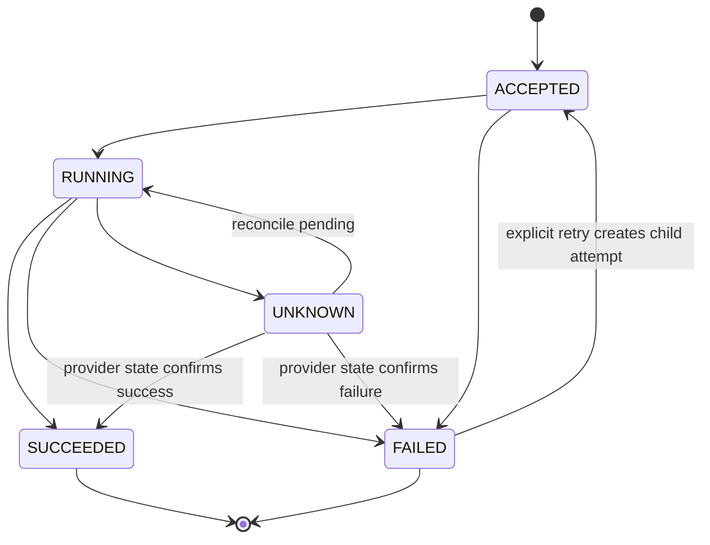

<!--
  Licensed to the Apache Software Foundation (ASF) under one
  or more contributor license agreements.  See the NOTICE file
  distributed with this work for additional information
  regarding copyright ownership.  The ASF licenses this file
  to you under the Apache License, Version 2.0 (the
  "License"); you may not use this file except in compliance
  with the License.  You may obtain a copy of the License at

    http://www.apache.org/licenses/LICENSE-2.0

  Unless required by applicable law or agreed to in writing,
  software distributed under the License is distributed on an
  "AS IS" BASIS, WITHOUT WARRANTIES OR CONDITIONS OF ANY
  KIND, either express or implied.  See the License for the
  specific language governing permissions and limitations
  under the License.
-->

# ADR-0001：托管 Flink 异步 Operation 与 REST 兼容性

- 状态：Proposed
- 评审准备度：Ready for architecture review，代码级兼容性复核无阻塞项
- 日期：2026-07-28
- 决策范围：`streampark-console-service`、`streampark-console-webapp`

## 背景

现有接口为同步接受语义：

```text
POST /flink/pipe/build    -> boolean
POST /flink/app/start     -> boolean true
POST /flink/app/cancel    -> success without operation data
```

对应 service 接口中 `start/cancel` 返回 `void`。云托管 Flink 的上线、启动、停止和
Savepoint 是异步控制面操作，必须返回可持久化和可恢复的 Operation。

直接把既有接口响应替换为 Operation DTO 会破坏当前前端和第三方 API 使用方。

## 决策

保留现有 URL 和旧模式响应契约；新增统一的托管操作接口。现有页面在
`MANAGED_APPLICATION` 模式下调用新接口，Remote/YARN/Kubernetes 继续调用旧接口。

```text
POST /flink/managed/app/release
POST /flink/managed/app/start
POST /flink/managed/app/stop
POST /flink/managed/app/snapshot
POST /flink/managed/operation/get
POST /flink/managed/operation/page
POST /flink/managed/operation/retry
```

首期不修改：

```text
/flink/pipe/build
/flink/app/start
/flink/app/cancel
/openapi/app/start
/openapi/app/cancel
```

后续若希望统一入口，应通过版本化 API 或兼容响应封装单独迁移。

代码级复核确认，`FlinkApplicationController` 和 `OpenAPIController` 都直接调用返回
`void` 的 `FlinkApplicationActionService.start/cancel`。因此托管入口必须使用独立
Controller 和 service，不得为了复用实现而修改该接口的返回类型。

## 请求与响应

```json
{
  "appId": 100001,
  "requestId": "client-generated-uuid",
  "expectedAppVersion": 12,
  "start": {
    "mode": "SPECIFIED_SNAPSHOT",
    "snapshotId": "sp-xxx",
    "allowNonRestoredState": false
  }
}
```

```json
{
  "operationId": 900001,
  "appId": 100001,
  "type": "START",
  "state": "ACCEPTED",
  "idempotentReplay": false,
  "createTime": "2026-07-28T12:00:00+08:00"
}
```

所有响应继续使用 `RestResponse.success(data)`。

## Operation 状态机



禁止将 UNKNOWN 自动转换为 FAILED。UNKNOWN 表示请求结果无法判断，需要通过
provider operation、job、instance 或 definition hash 对账。

## Provider SPI 调整

Provider 返回异步句柄，并提供对账接口：

```java
ManagedOperationResult deploy(ProviderContext context, DeployRequest request);

ManagedOperationResult start(ProviderContext context, StartRequest request);

ManagedOperationResult stop(ProviderContext context, StopRequest request);

ProviderOperationStatus getOperation(
    ProviderContext context, ProviderOperationRef operationRef);

ManagedJob getJob(ProviderContext context, ManagedJobRef jobRef);
```

如果厂商不支持 `getOperation`，capability 必须声明
`supportsOperationQuery=false`，orchestrator 使用 `getJob` 和外部 ID 对账。

## 幂等策略

两级幂等：

1. StreamPark 幂等：数据库唯一键阻止相同意图并发执行。
2. Provider 幂等：如果 API 支持 client token，传入稳定 token；否则在超时后先查询，
   禁止直接重放 create/deploy。

建议唯一键：

```text
(app_id, operation_type, idempotency_key)
```

Operation 保存不可变的请求快照。用户修改候选配置不会改变执行中的 Operation。
同一唯一键再次请求时必须比较 `request_hash`：hash 相同返回已有 Operation，hash 不同
返回 `CONFLICT`，不得静默复用。用户显式重试创建新的 attempt 和新的 provider token，
通过 `parent_operation_id` 关联原 Operation。

## 并发规则

| 当前操作 | 新操作 | 结果 |
| --- | --- | --- |
| RELEASE | RELEASE | 同一 hash 返回已有 Operation；不同 hash 拒绝 |
| RELEASE | START/STOP | 拒绝 |
| START | START | 返回已有 Operation |
| START | STOP | 拒绝，除非 Provider 已确认 RUNNING |
| STOP | STOP | 返回已有 Operation |
| STOP | START | 拒绝 |
| SNAPSHOT | SNAPSHOT | 相同意图去重 |
| SNAPSHOT | STOP_WITH_SNAPSHOT | 拒绝重复快照 |

## 超时和恢复矩阵

| 阶段 | 超时后动作 | 禁止动作 |
| --- | --- | --- |
| 文件上传 | 按 checksum/fileId 查询 | 盲目重复上传 |
| 创建草稿 | 按外部 draftId/name+tag 查询 | 盲目重复创建 |
| 更新草稿 | 比较 definition hash/revision | 直接标记成功 |
| 上线 | 查询 operation/job/version | 盲目再次上线 |
| 启动 | 查询 job/instance state | 再次 start |
| 停止 | 查询 instance state | 直接把本地置为 STOPPED |
| Savepoint | 查询快照列表及描述标签 | 重复创建同一快照 |

## 重试

- AUTHENTICATION、AUTHORIZATION、VALIDATION、NOT_FOUND 不自动重试。
- RATE_LIMIT 遵守服务端 retry-after，否则指数退避并增加 jitter。
- TRANSIENT 最多三次，超出后进入 UNKNOWN 并交给 reconcile。
- 用户点击重试时创建新的 attempt，并通过 `parent_operation_id` 关联原 Operation。

## 权限

Controller 同时执行：

- `@RequiresPermissions`：功能权限。
- `@Permission(app = "#request.appId")`：App/Team 资源隔离。

Service 每次操作重新校验 app、managed environment、cloud account 和 Team grant，
不能只相信 Controller 或前端下拉数据。

## 结果

优点：

- 不破坏现有 API。
- 托管操作拥有独立、可恢复的异步契约。
- 为未来其他云 Provider 保持稳定边界。

代价：

- 首期存在 legacy 和 managed 两组生命周期入口。
- 前端需按 Deploy Mode 路由。

## 验收

- 旧接口契约测试保持不变。
- Managed 接口重复请求返回同一 Operation。
- 服务重启后可恢复 ACCEPTED/RUNNING/UNKNOWN。
- 断网、超时和限流不会创建重复云资源。
- 越权访问 Operation 返回拒绝。
- `/flink/app/*` 和 `/openapi/app/*` 的既有响应契约保持不变。
- 相同 idempotency key 但不同 request hash 返回 `CONFLICT`。
- START 只有在 Provider 确认新的运行实例后成功；STOP 只有在 Provider 确认目标实例
  停止后成功；SNAPSHOT 只有在 Savepoint 状态为 `AVAILABLE` 后成功。

## 架构评审签字

| 决议项 | 推荐结论 | 状态 |
| --- | --- | --- |
| 新增独立 Managed REST API，不修改旧入口 | 接受 | 待架构责任人确认 |
| Operation 持久化状态机和 UNKNOWN 对账 | 接受 | 待架构责任人确认 |
| request hash + idempotency key 冲突规则 | 接受 | 待架构责任人确认 |
| Provider SPI 返回异步句柄 | 接受 | 待架构责任人确认 |
| Managed Controller 与 legacy action service 隔离 | 接受 | 待架构责任人确认 |
