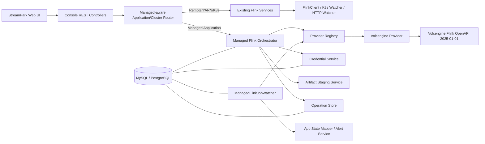
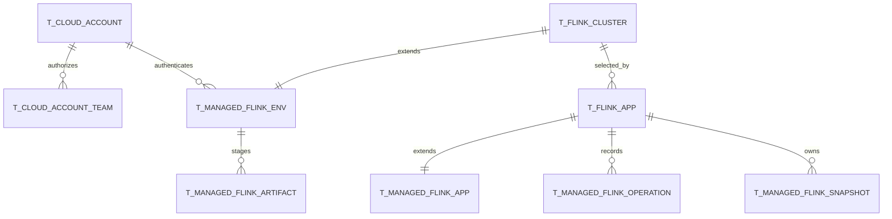
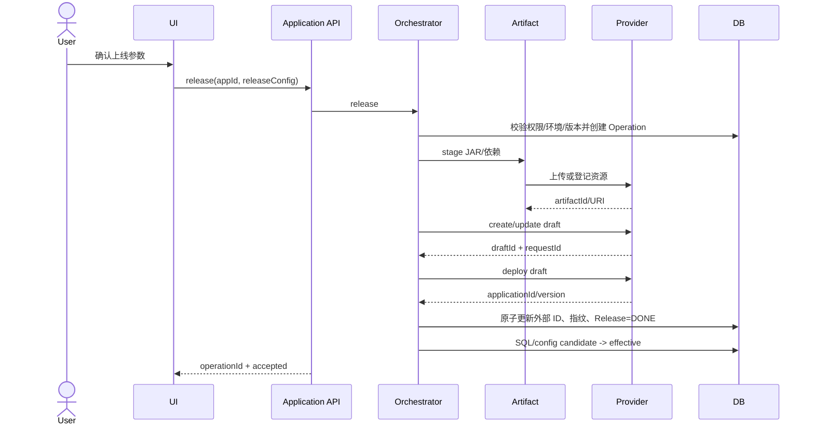
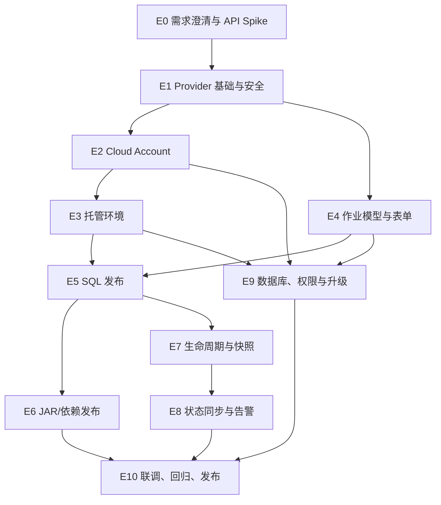

<!--
  Licensed to the Apache Software Foundation (ASF) under one
  or more contributor license agreements.  See the NOTICE file
  distributed with this work for additional information
  regarding copyright ownership.  The ASF licenses this file
  to you under the Apache License, Version 2.0 (the
  "License"); you may not use this file except in compliance
  with the License.  You may obtain a copy of the License at

    http://www.apache.org/licenses/LICENSE-2.0

  Unless required by applicable law or agreed to in writing,
  software distributed under the License is distributed on an
  "AS IS" BASIS, WITHOUT WARRANTIES OR CONDITIONS OF ANY
  KIND, either express or implied.  See the License for the
  specific language governing permissions and limitations
  under the License.
-->

# StreamPark 对接云厂商托管 Flink 技术分析与详细设计

## 文档信息

| 项目 | 内容 |
| --- | --- |
| 需求来源 | [PRD：StreamPark 对接云厂商托管 Flink（火山引擎）](https://bytedance.my.larkoffice.com/docx/XnVZdKX7HoBearx15PRmLufAyhf) |
| PRD 版本 | V1.0，飞书 revision 92 |
| 技术文档状态 | 方案草案，待产品、架构、安全和研发评审 |
| 首期云厂商 | 火山引擎流式计算 Flink 版 |
| 首期作业类型 | Flink SQL、Flink JAR |
| 适用模块 | `streampark-common`、`streampark-console-service`、`streampark-console-webapp` |
| 不涉及模块 | Spark、Flink shims 的版本实现、现有 Remote/YARN/Kubernetes 提交实现 |

## 1. 结论摘要

本需求可行，但不能把云托管 Flink 简单实现成现有 `FlinkClient` 的又一个本地提交客户端。现有客户端链路以本地 `FlinkEnv`、Flink 发行版、workspace、Flink CLI/REST 和 shims 为核心；云托管 Flink 的控制面则是异步 OpenAPI、云侧草稿/上线版本/运行实例、云资源池、云快照和云文件。两者的资源模型、状态模型和失败语义不同。

推荐方案如下：

1. 在 `FlinkDeployMode` 中新增厂商中立的 `MANAGED_APPLICATION(7, "managed-application")`，厂商类型单独保存为 `provider_type`。不要增加 `VOLCENGINE`、`ALIYUN`、`AWS` 等一厂商一 Deploy Mode 的枚举。
2. Provider SPI 和火山实现放在 `streampark-console-service` 内，不新增 Maven 模块，不修改 Flink shims。
3. 现有 Applications/Clusters/告警/权限/版本 UI 继续作为统一控制面；云侧 Provider 只接管托管模式的目录查询、发布、启动、停止、状态和快照。
4. StreamPark 是“开发定义”的事实源，云厂商是“运行状态”的事实源。通过配置指纹、外部 ID 和操作记录处理双端一致性与漂移。
5. 云凭证必须使用可轮换的 AES-GCM 信封加密，密钥来自部署环境或外部密钥系统。现有 `EncryptUtils` 使用固定默认密钥和非认证加密，不适合保存云 AK/SK。
6. 状态同步使用独立的 `ManagedFlinkJobWatcher`，采用数据库租约、分组限流、抖动和退避，不把托管作业加入 `FlinkAppHttpWatcher`。
7. 云快照使用独立表，不直接复用只支持文件路径语义的 `t_flink_savepoint`；查询层统一为一个快照 View。
8. SQL/JAR 上线前必须先做 API Spike。尤其要验证项目列表接口、JAR/依赖文件上传链路、引擎版本发现、深度检查、幂等能力和限流配额。

在 2 名后端、1 名前端、1 名测试参与的情况下，建议按 6～8 周交付首期；总研发与测试工作量粗估为 75～105 人日。该估算需要在 API Spike 后校准。

## 2. 需求分析

### 2.1 业务目标

需求要构建的不是单一“火山作业提交按钮”，而是 StreamPark 的云托管 Flink 控制面：

- 一个入口管理自建和云托管 Flink 作业。
- 复用 StreamPark 的 SQL/JAR 开发、配置、版本、权限、操作日志和告警能力。
- 把云账号、地域、项目和资源池组织成可复用的托管环境。
- 支持上线、启动、停止、快照恢复和状态同步的闭环。
- 首期落地火山引擎，同时保证后续 Provider 可扩展。

### 2.2 角色和权限诉求

| 角色 | 核心操作 | 推荐权限边界 |
| --- | --- | --- |
| 平台管理员 | 新增、更新、测试、停用、删除云账号 | 平台级 Cloud Account 权限 |
| Team 管理员 | 将授权的云账号绑定为 Team 可用环境 | Team 资源管理权限 |
| 开发工程师 | 创建/编辑 SQL 或 JAR 作业、发起上线 | `app:create`、`app:update`、`app:release` |
| 运维工程师 | 启动、停止、快照恢复、查看运行状态 | `app:start`、`app:cancel`、`savepoint:*` |
| 只读用户 | 查看作业、环境、运行状态和操作记录 | `app:view`、`app:detail` |

PRD 同时提出“凭证平台级统一登记”和“与 Team 权限打通”，但未定义凭证是否默认对全部 Team 可见。技术方案建议采用“平台级凭证 + 显式 Team 授权”，避免任意 Team 枚举或使用全部云账号。

### 2.3 首期范围

首期必须交付：

- 火山云账号 CRUD、脱敏、测试连通、引用保护。
- 火山项目/资源池登记为 `FlinkCluster` 托管环境。
- SQL 和 JAR 托管作业创建、编辑、版本管理。
- 草稿同步、上线、启动、停止、快照列表和快照恢复。
- 托管状态同步、列表聚合、详情链接、失败告警。
- MySQL 和 PostgreSQL 全量 schema 与升级脚本。
- Provider SPI、火山 Provider 和可测试的 Provider contract。

首期明确不做：

- 创建、扩缩、删除云项目或资源池。
- 阿里云、AWS Provider 实现。
- 云侧 Flink UI/日志/指标的深度代理。
- PyFlink、CDC 专用作业、Batch 专用交互。
- 自动调优、智能诊断、成本优化。
- 改变现有 Remote/YARN/Kubernetes 行为。

### 2.4 产品需求决策

以下问题已于 2026-07-28 在飞书文档 revision 65 完成书面决策：

| 编号 | 问题 | 影响 | 最终结论 | 状态 |
| --- | --- | --- | --- | --- |
| D-01 | 云账号对 Team 的可见范围未定义 | 凭证越权风险 | 平台管理员登记，显式授权 Team | 同意 |
| D-02 | 删除 StreamPark 作业是否删除/下线云作业 | 可能产生孤儿作业或误删生产作业 | 首期仅允许停止后删除本地记录；默认不删除云资源，单独提供解绑提示 | 同意 |
| D-03 | 云控制台直接修改作业后的处理策略 | 双端配置漂移 | StreamPark 定义为发布源；检测漂移并阻止覆盖前要求确认 | 同意 |
| D-04 | “秒级同步”没有量化 SLO | API 限流与成本不可控 | 变更态 5 秒、运行态 15 秒、稳定停止态 60 秒；P95 可见延迟目标 30 秒 | 同意 |
| D-05 | 引擎版本列表是否硬编码 | 云端版本会变化 | Provider 能力接口动态返回，短 TTL 缓存；配置仅作兜底 | 同意 |
| D-06 | JAR 与依赖如何上传云侧 | 直接决定发布链路 | API Spike 验证资源文件 API/TOS URI/直传能力 | 同意 |
| D-07 | 首期是否包括流式和批式 | Checkpoint、GANG、启动方式规则不同 | 首期暂不支持批作业，仅交付 Streaming SQL/JAR | 已决 |
| D-08 | 云侧深度 SQL 检查是否有开放 API | “跳过检查”参数可能无法映射 | Provider capability 标记；不支持时隐藏开关 | 同意 |
| D-09 | 自定义 Endpoint 的安全边界 | SSRF 与凭证泄露风险 | 默认只允许官方 HTTPS Endpoint；自定义地址仅超级管理员可配并受 allowlist 控制 | 同意 |
| D-10 | 云账号密钥轮换流程 | 更新时可能中断运行操作 | 新旧密钥版本化；测试成功后原子切换 | 同意 |

## 3. 官方能力核对

火山引擎当前公开的 Flink OpenAPI 版本为 `2025-01-01`。官方 API 目录已列出以下首期所需能力：

- `CreateGWSApplicationDraft`：创建作业草稿。
- `UpdateGWSApplicationDraft`：更新作业草稿。
- `DeployGWSApplicationDraft`：上线作业。
- `StartApplicationInstance`：启动作业实例。
- `CancelApplicationInstance`：停止作业实例。
- `GetApplicationInstance` / `ListApplicationInstance`：查询作业实例。
- `GetGWSStartMethod`：获取可用启动方式。
- `ListGWSSavepoint` / `CreateGWSSavepoint`：查询和创建快照。
- `ListGWSApplication`：查询作业。
- `ListGMCSResources`：获取项目下资源池列表。

参考：

- [火山引擎 Flink OpenAPI 概览](https://api.volcengine.com/api-docs/view?action=GetGWSStartMethod&serviceCode=flink&version=2025-01-01)
- [火山引擎 Flink SDK 参考](https://www.volcengine.com/docs/6581/2137747?lang=zh)
- [上线 Flink 任务](https://www.volcengine.com/docs/6581/151715)
- [计算任务基础操作](https://www.volcengine.com/docs/6581/151453)
- [配置 Flink 参数](https://www.volcengine.com/docs/6581/413744?lang=zh)
- [上传资源文件](https://www.volcengine.com/docs/6581/152196)

官方用户文档还确认：

- Flink 资源池以 CU 计量，1 CU = 1 CPU + 4 GiB。
- Stream 作业支持从最新状态、全新状态或指定 Savepoint 启动。
- 开启 Checkpoint 后，停止时可先创建 Savepoint。
- Batch 作业不支持 GANG，只支持 DRF。
- JAR 和依赖资源文件需要先进入云侧资源文件系统，单文件限制和具体上传通道必须以 OpenAPI 实测为准。

官方 API 目录证明“能力存在”，但不能替代请求字段、返回状态、权限和幂等行为验证。M0 阶段必须使用最小权限测试账号完成端到端 Spike，并固化录制的脱敏请求/响应样例。

## 4. StreamPark 现状与差距

### 4.1 当前部署模式

`streampark-common/.../FlinkDeployMode.java` 当前定义：

- `REMOTE(1)`
- `YARN_PER_JOB(2)`
- `YARN_SESSION(3)`
- `YARN_APPLICATION(4)`
- `KUBERNETES_NATIVE_SESSION(5)`
- `KUBERNETES_NATIVE_APPLICATION(6)`

新增枚举值会影响较广。静态审计发现 Deploy Mode 相关判断分布在 93 个
Java/Scala/TypeScript/Vue 文件中，其中至少 27 个包含显式分支或 `switch`。
核心风险不是枚举声明本身，而是 workspace、build pipeline、watcher 和 URL proxy 分流。

### 4.2 当前作业提交链路

现有链路：

```text
Applications UI
  -> FlinkApplicationController
  -> FlinkApplicationActionServiceImpl
  -> SubmitRequest / CancelRequest
  -> FlinkClientEntrypoint
  -> Remote/YARN/Kubernetes Client
  -> Flink REST/CLI/Kubernetes
```

该链路存在以下云托管不适配点：

- `start()` 无条件读取 `FlinkEnv` 和本地 build pipeline。
- `SubmitRequest` 需要本地 Flink 版本、Flink conf、build result、workspace 和 job JAR。
- `FlinkClientEntrypoint` 的客户端实现是 Flink 数据面/集群提交客户端。
- `FlinkApplication.getAppHome()` 和 `getStorageType()` 对未知模式直接抛异常。
- `FlinkApplicationBuildPipelineServiceImpl` 对 Deploy Mode 做穷举，并校验本地 Flink 环境。
- 现有 savepoint 以文件系统路径为核心，删除操作会调用 `FsOperator`。

因此托管模式必须在 Console service 的操作路由层提前分流，不能继续构造 `SubmitRequest`。

### 4.3 当前状态追踪

- `FlinkAppHttpWatcher` 追踪 Remote/YARN 等 Flink REST 或 YARN 状态。
- Kubernetes 使用独立 watcher 和事件监听。
- `FlinkClusterWatcher` 的 Remote/YARN 探活周期是 30 秒。
- 现有 watcher 依赖进程内静态缓存，适用于当前单控制面语义，但不足以保障多实例下云 API 的去重轮询。

云托管应新增 DB 驱动的 watcher，并复用最终的状态持久化、告警模板与 Applications 查询，而不是复用状态获取实现。

### 4.4 当前前端

前端部署模式与表单分支集中在：

- `src/enums/flinkEnum.ts`
- `views/flink/app/data/index.ts`
- `views/flink/app/hooks/useCreateAndEditSchema.ts`
- `views/flink/app/components/AppView/StartApplicationModal.vue`
- `views/flink/app/components/AppView/StopApplicationModal.vue`
- `views/flink/cluster/useClusterSetting.ts`
- `views/flink/cluster/View.vue`

当前表单大量使用 `deployMode == ...` 直接判断。首期可以增加 managed helper，但应避免继续扩散厂商判断。云特有表单建议封装为 `ManagedFlinkFormSection`，通过 capability DTO 驱动。

### 4.5 当前数据库

现有主表：

- `t_flink_app`：作业基础信息、运行状态和自建部署字段。
- `t_flink_cluster`：Remote/YARN/Kubernetes session 环境。
- `t_flink_sql`、`t_flink_app_backup`：SQL 与发布版本。
- `t_flink_savepoint`：基于文件路径的 checkpoint/savepoint。
- `t_app_build_pipe`：本地构建流水线。

不能把云账号密文、项目、资源池、云实例、操作记录全部塞入 `options` JSON。核心标识、引用、状态和审计信息需要规范化表结构；可变 Provider 参数才存 JSON。

## 5. 架构设计

### 5.1 设计原则

- 厂商中立：Deploy Mode 表达“托管应用”，Provider 表达具体厂商。
- 控制面分流：自建模式走现有 `FlinkClient`，托管模式走 Provider。
- 事实源分离：StreamPark 管开发定义，Provider 管运行事实。
- 能力驱动：版本、启动方式、调度策略等由 Provider capability 决定。
- 异步优先：云操作返回 Operation，状态由 watcher 最终收敛。
- 敏感信息最小暴露：密钥不出 service，响应永不返回明文。
- 向后兼容：旧 Deploy Mode 数值、接口和现有 watcher 不变。
- 可恢复：每个云写操作必须有幂等键、操作记录和重试边界。

### 5.2 总体架构



### 5.3 模块落位

首期不新增 Maven 模块，建议在 `streampark-console-service` 新增：

```text
org.apache.streampark.console.core.managed
├── api
│   ├── ManagedFlinkProvider.java
│   ├── ManagedFlinkProviderRegistry.java
│   ├── ManagedFlinkCapability.java
│   └── model/...
├── provider
│   └── volcengine
│       ├── VolcengineManagedFlinkProvider.java
│       ├── VolcengineFlinkClient.java
│       ├── VolcengineRequestMapper.java
│       └── VolcengineStateMapper.java
├── service
│   ├── CloudAccountService.java
│   ├── ManagedFlinkEnvironmentService.java
│   ├── ManagedFlinkApplicationService.java
│   ├── ManagedFlinkOperationService.java
│   ├── ManagedFlinkArtifactService.java
│   └── CredentialCryptoService.java
├── watcher
│   └── ManagedFlinkJobWatcher.java
└── controller
    ├── CloudAccountController.java
    └── ManagedFlinkMetadataController.java
```

生命周期入口仍保留在现有 application controller/service。`FlinkApplicationActionServiceImpl` 在最前面按 `isManagedMode()` 路由到 `ManagedFlinkApplicationService`，其他模式不变。

### 5.4 Deploy Mode 决策

新增：

```java
MANAGED_APPLICATION(7, "managed-application")
```

同时新增：

```java
isManagedMode(FlinkDeployMode mode)
isManagedMode(Integer mode)
```

不采用 `VOLCENGINE_APPLICATION` 的原因：

- Deploy Mode 是执行形态，不应承担厂商维度。
- 多云后不会继续消耗枚举值和复制所有 switch。
- UI 可根据环境的 `providerType` 显示“火山托管”“阿里托管”等标签。
- Provider capability 可以表达厂商差异，应用路由保持稳定。

## 6. Provider SPI 设计

### 6.1 接口

```java
public interface ManagedFlinkProvider {

    ManagedFlinkProviderType type();

    ManagedFlinkCapability getCapability(ProviderContext context);

    CredentialCheckResult validateCredential(ProviderContext context);

    List<CloudProject> listProjects(ProviderContext context, String keyword);

    List<ResourcePool> listResourcePools(
        ProviderContext context, String projectId, String keyword);

    StagedArtifact stageArtifact(
        ProviderContext context, ArtifactStageRequest request);

    ManagedDraft upsertDraft(
        ProviderContext context, DraftUpsertRequest request);

    ManagedDeployment deploy(
        ProviderContext context, DeployRequest request);

    ManagedOperation start(
        ProviderContext context, StartRequest request);

    ManagedOperation stop(
        ProviderContext context, StopRequest request);

    ManagedJob getJob(
        ProviderContext context, ManagedJobRef jobRef);

    List<ManagedSnapshot> listSnapshots(
        ProviderContext context, ManagedJobRef jobRef);

    ManagedSnapshot createSnapshot(
        ProviderContext context, SnapshotCreateRequest request);

    String getConsoleUrl(
        ProviderContext context, ManagedJobRef jobRef);
}
```

### 6.2 SPI 边界

SPI 只暴露 StreamPark 规范化模型，不暴露火山 SDK 类。Provider 内完成：

- 鉴权和 Endpoint 选择。
- 请求字段和默认值映射。
- Provider 状态映射。
- 错误码分类。
- Provider 原始响应脱敏和可观测性。

Provider 不负责：

- StreamPark RBAC。
- 数据库事务。
- 应用版本生效。
- 告警发送。
- UI 展示。

### 6.3 Capability

`ManagedFlinkCapability` 至少包含：

```text
providerType
apiVersion
engineVersions[]
jobTypes[]
executionModes[]
startModes[]
schedulingStrategies[]
supportsProjectList
supportsResourcePoolList
supportsSqlDeepCheck
supportsSkipPrecheck
supportsStopWithSnapshot
supportsCreateSnapshot
supportsJarDirectUpload
supportsCustomEndpoint
minCpu
cpuStep
memoryPerCpuGiB
maxArtifactBytes
customParameterRules
capabilityRevision
expireAt
```

前端不硬编码 `Flink 1.11/1.16/1.17/1.20/2.2`。Provider 无法查询时使用经过验证的内置 capability，并在 UI 标记“缓存能力信息”。

Capability 解析结果显式携带来源：

| 来源 | 含义 | UI/调用方行为 |
| --- | --- | --- |
| `LIVE` | 本次从 Provider 成功获取 | 正常展示 |
| `CACHE` | `expireAt` 之前的进程内缓存 | 可正常使用，同时可标记缓存命中 |
| `STALE_CACHE` | Provider 可重试失败时使用的过期缓存 | 必须标记降级和数据时间 |
| `BUILT_IN` | 无缓存时使用经过验证的内置能力 | 必须标记降级，不得宣称实时 |

缓存键由 provider type 和不含明文凭证的 `ProviderContext` 组成。实时 capability 到达
`expireAt` 后触发刷新；只有 `RATE_LIMIT`、`TRANSIENT`、`UNKNOWN` 等可重试错误允许
回退。`AUTHENTICATION`、`AUTHORIZATION`、`VALIDATION` 等不可重试错误必须原样返回，
禁止用旧缓存掩盖凭证或权限故障。过期缓存最多使用 24 小时，超过后仅可回退到内置
能力或返回 Provider 错误。所有 capability 集合字段构建后不可变，避免调用方修改共享
缓存内容。

### 6.4 Provider 错误分类

统一错误类别：

| 类别 | 示例 | 是否重试 | UI 行为 |
| --- | --- | --- | --- |
| `AUTHENTICATION` | AK/SK 无效、签名错误 | 否 | 提示测试/更新凭证 |
| `AUTHORIZATION` | 缺少项目或作业权限 | 否 | 展示所需最小权限 |
| `VALIDATION` | 参数、版本、资源规格错误 | 否 | 定位到表单字段 |
| `CONFLICT` | 作业正在启动/停止、版本冲突 | 查询后决定 | 刷新状态 |
| `PROVIDER_CONFIGURATION` | 资源池 DNS/HostAlias 等云环境配置错误 | 人工修复后 | 展示脱敏事件和修复建议 |
| `QUOTA` | CU、文件大小或账号配额不足 | 否 | 展示配额和容量建议 |
| `RATE_LIMIT` | QPS 超限 | 是 | 退避并显示排队 |
| `TRANSIENT` | 5xx、网络超时 | 是 | 指数退避 |
| `NOT_FOUND` | 云作业被删除 | 否 | 标记漂移/失联 |
| `UNKNOWN` | 未识别错误 | 有界重试 | 保存 requestId 供排查 |

错误解析顺序固定为服务端 error code、HTTP status、受控兼容 pattern、UNKNOWN。不得将
HTTP 2xx 直接等同于成功：M0 实测中，同名文件冲突和超范围 long 的服务端反序列化失败
都以 `error.detail.status=200` 返回，同时携带 requestId。`providerRequestId` 必须可空，
因为本地校验、not-found 和网络错误不保证存在 requestId。

限流映射覆盖 HTTP 429、`Throttling`、`RequestLimitExceeded` 和 `TooManyRequests`。
优先遵守 `Retry-After`；缺失时使用指数退避和 jitter。读取请求可以有界重试；写请求
重试前必须通过 idempotency key、provider operation 或资源状态完成对账。真实限流不在
共享测试账号上通过高频调用制造，而是在 fake HTTP server 和 Q-03 故障注入中验收。

## 7. 数据模型设计

### 7.1 关系模型



### 7.2 `t_cloud_account`

| 字段 | 类型建议 | 说明 |
| --- | --- | --- |
| `id` | bigint PK | 主键 |
| `account_name` | varchar(128) | 平台内唯一名称 |
| `provider_type` | varchar(32) | `VOLCENGINE` |
| `region` | varchar(64) | 地域 |
| `endpoint` | varchar(255) | 可选自定义 Endpoint |
| `access_key_ciphertext` | text | 加密后的 AK |
| `secret_key_ciphertext` | text | 加密后的 SK |
| `credential_key_version` | int | 主密钥版本 |
| `access_key_mask` | varchar(64) | 可展示掩码 |
| `connectivity_state` | tinyint | 未测试/正常/失败/过期 |
| `last_check_time` | datetime/timestamp | 最近测试时间 |
| `last_error_code` | varchar(64) | 脱敏错误码 |
| `last_error_message` | varchar(512) | 脱敏错误 |
| `status` | tinyint | 启用/停用 |
| `description` | varchar(255) | 描述 |
| `create_user_id` | bigint | 创建人 |
| `create_time` / `modify_time` | datetime/timestamp | 审计时间 |
| `version` | int | 乐观锁 |

唯一约束：`(provider_type, account_name)`。

接口只返回 `access_key_mask`。编辑时若 AK/SK 为空表示保持原密钥，禁止把掩码字符串当成新密钥写回。

### 7.3 `t_cloud_account_team`

| 字段 | 说明 |
| --- | --- |
| `cloud_account_id` | 云账号 |
| `team_id` | 被授权 Team |
| `permission_level` | `USE` 或 `MANAGE`，首期可只实现 `USE` |
| `create_user_id` / `create_time` | 审计 |

唯一约束：`(cloud_account_id, team_id)`。

### 7.4 `t_managed_flink_env`

`t_flink_cluster` 继续保存通用名称、Deploy Mode、状态、告警和描述；扩展表保存云资源信息。

| 字段 | 说明 |
| --- | --- |
| `cluster_id` | PK/FK，关联 `t_flink_cluster.id` |
| `provider_type` | 厂商 |
| `cloud_account_id` | 凭证引用 |
| `region` | 地域快照 |
| `project_id` / `project_name` | 云项目 |
| `resource_pool_id` / `resource_pool_name` | 默认资源池 |
| `console_url` | 环境控制台基础地址；禁止保存 query/fragment 或访问令牌 |
| `capability_json` | 保存时的能力快照 |
| `last_probe_time` | 最近探活 |
| `last_probe_error` | 脱敏错误 |
| `version` | 乐观锁 |

托管环境是“登记记录”，不支持现有 Cluster 的 start/shutdown。其状态表示连接可用性：

- `CREATED`：尚未验证。
- `RUNNING`：凭证、项目、资源池可访问。
- `LOST`：连续探测失败。
- `FAILED`：配置明确无效。

### 7.5 `t_managed_flink_app`

| 字段 | 说明 |
| --- | --- |
| `app_id` | PK/FK，关联 `t_flink_app.id` |
| `managed_env_id` | 关联托管环境 |
| `provider_type` | 冗余用于高效路由和审计 |
| `external_draft_id` | 云草稿 ID |
| `external_application_id` | 云作业 ID |
| `external_instance_id` | 当前运行实例 ID |
| `engine_version` | 云端引擎版本字符串 |
| `execution_mode` | 首期固定 `STREAMING` |
| `runtime_config_json` | 规范化资源/Checkpoint/重启参数 |
| `release_config_json` | 资源池、优先级、调度策略等 |
| `local_definition_hash` | 本地待发布指纹 |
| `deployed_definition_hash` | 已发布指纹 |
| `provider_definition_hash` | 可获取时保存云侧指纹 |
| `provider_raw_state` | 最近原始状态 |
| `sync_state` | `HEALTHY/DEGRADED/DRIFTED/NOT_FOUND` |
| `last_sync_time` | 成功同步时间 |
| `consecutive_sync_failures` | 连续失败次数 |
| `next_sync_time` | 下次轮询时间 |
| `sync_owner` / `sync_lease_until` | 多实例 watcher 租约 |
| `console_url` | 经 allowlist 校验的基础地址；优先按 external ID 临时生成跳转链接 |
| `version` | 乐观锁 |

### 7.6 `t_managed_flink_operation`

所有云写操作必须先落操作记录：

| 字段 | 说明 |
| --- | --- |
| `id` | Operation ID |
| `app_id` | 作业 |
| `operation_type` | `RELEASE/START/STOP/SNAPSHOT/ARTIFACT_STAGE` |
| `idempotency_key` | StreamPark 幂等键，唯一 |
| `provider_request_id` | 云 requestId |
| `provider_operation_id` | 云异步任务 ID（若有） |
| `state` | `ACCEPTED/RUNNING/SUCCEEDED/FAILED/UNKNOWN` |
| `request_json` | 已脱敏的规范化请求 |
| `result_json` | 已脱敏结果 |
| `error_code` / `error_message` | 失败信息 |
| `retry_count` / `next_retry_time` | 重试 |
| `create_user_id` | 操作人 |
| `create_time` / `start_time` / `finish_time` | 时间 |

幂等键示例：

```text
release:{appId}:{localDefinitionHash}
start:{appId}:{deployedDefinitionHash}:{startMode}:{snapshotId}
stop:{appId}:{externalInstanceId}:{withSnapshot}
```

### 7.7 `t_managed_flink_snapshot`

不直接复用 `t_flink_savepoint.path`，避免文件删除语义误伤云快照。

| 字段 | 说明 |
| --- | --- |
| `id` | 本地主键 |
| `app_id` | StreamPark 作业 |
| `external_snapshot_id` | 云快照 ID |
| `external_instance_id` | 来源实例 |
| `snapshot_type` | `MANUAL/STOP_WITH_SAVEPOINT/CHECKPOINT` |
| `state` | `CREATING/COMPLETED/FAILED/EXPIRED` |
| `location` | 云侧返回的可选地址，不由 `FsOperator` 删除 |
| `is_latest` | 最新快照 |
| `trigger_time` / `create_time` | 时间 |
| `metadata_json` | Provider 扩展信息 |

`SavepointController` 查询层根据 Deploy Mode 路由，返回统一 `SnapshotView`。

### 7.8 `t_managed_flink_artifact`

| 字段 | 说明 |
| --- | --- |
| `id` | 主键 |
| `managed_env_id` | 环境 |
| `source_resource_id` | StreamPark Resource；允许为空，源资源删除后保留云制品缓存 |
| `checksum` | SHA-256，缓存键 |
| `file_name` / `file_size` | 文件元数据 |
| `provider_artifact_id` / `provider_uri` | 云引用 |
| `state` | `STAGING/READY/FAILED/DELETED` |
| `reference_count` | 引用数 |
| `create_time` / `modify_time` | 时间 |

同一环境、同一 checksum 的 JAR/依赖可复用，避免每次上线重复上传。

### 7.9 现有表变更

建议：

- `t_flink_cluster.version_id` 允许为空，因为托管环境不依赖本地 Flink Home。
- `t_flink_app.version_id` 对托管模式允许为空。
- `t_flink_app.flink_cluster_id` 复用为托管环境 ID。
- `t_flink_app.job_id` 可保留规范化当前实例 ID，但完整外部标识以扩展表为准。
- `t_flink_app.job_manager_url` 对托管模式不得保存云侧带签名或令牌的完整链接。
  推荐新增 transient `consoleUrl`，按 external ID 临时生成短 TTL 跳转地址；
  不要让 REST proxy 错误代理云控制台。
- 云侧返回的 URL query/fragment 一律按凭证处理，禁止写入数据库、Operation JSON、
  日志、异常、指标标签、localStorage 或前端埋点。

所有 schema 变化必须同时更新：

- MySQL 全量 schema。
- PostgreSQL 全量 schema。
- MySQL 升级脚本。
- PostgreSQL 升级脚本。
- 菜单、权限和管理员默认授权数据。
- 如果字段/DDL 方言不同，更新 `sql-rev.dict` 并做双库测试。

## 8. 凭证与安全设计

### 8.1 加密

禁止直接复用现有 `EncryptUtils` 保存 AK/SK。推荐格式：

```text
version | algorithm | keyId | randomIV | ciphertext | authTag
```

要求：

- `AES/GCM/NoPadding`。
- 每次加密使用 96-bit 随机 IV。
- AAD 绑定 `providerType + accountId + fieldName`，防止密文串换。
- 主密钥不写数据库、不进 Git、不输出日志。
- 主密钥通过环境变量、挂载 Secret 或企业 KMS 注入。
- 密文包含 key version，支持在线轮换。
- 解密只发生在 Provider 调用前的最小作用域，明文对象不缓存、不序列化。

如果项目决定接入云 KMS 或第三方 secrets SDK，属于新增依赖，需要单独进行 Apache License 和依赖评审。

### 8.2 脱敏

- AK 展示：保留前 2～4 位和后 4 位。
- SK 永不返回，即使创建成功也不回显。
- Provider 请求日志移除 Authorization、AK、SK、Token、签名和 SQL 中可能存在的变量值。
- 错误信息经过 allowlist，不能直接把 SDK request dump 返回前端。
- 操作记录的 `request_json` 只保存资源 ID、配置和参数，不保存凭证。

### 8.3 Endpoint 与 SSRF

- 默认 Endpoint 由 Provider 根据 region 生成。
- 自定义 Endpoint 只允许 `https`。
- 禁止 URL userinfo、fragment 和非预期 path。
- 默认 allowlist 为官方域名。
- 私有化 Endpoint 必须由超级管理员在服务器配置 allowlist，不能由普通表单任意放开。
- 重定向默认关闭，或只允许同 host。

### 8.4 RBAC

新增权限：

```text
cloud-account:view
cloud-account:create
cloud-account:update
cloud-account:delete
cloud-account:test
cloud-account:grant
managed-flink:metadata
managed-flink:snapshot
```

作业生命周期继续复用：

```text
app:release
app:start
app:cancel
app:view
app:detail
```

Cloud Account controller 必须显式标注 `@RequiresPermissions`。Team 使用校验不能只依赖前端下拉过滤，后端每次 release/start/stop 都要验证“app.team_id -> cloud account grant”仍有效。

## 9. 作业配置模型

### 9.1 规范化配置

建议新建 DTO，而不是继续向 `FlinkApplication.options` 无约束追加：

```text
ManagedFlinkRuntimeConfig
├── engineVersion
├── executionMode
├── resource
│   ├── parallelism
│   ├── taskManagerCpu
│   ├── taskManagerMemoryGiB
│   ├── taskManagerSlots
│   ├── jobManagerCpu
│   └── jobManagerMemoryGiB
├── checkpoint
│   ├── enabled
│   ├── intervalMs
│   ├── timeoutMs
│   ├── stateTtlMs
│   └── backend
├── restartStrategy
│   ├── type
│   └── parameters
├── retryOnFailure
└── customProperties
```

Provider mapper 将规范化配置转换成火山请求。未知自定义参数保持 key/value，不允许覆盖由结构化表单管理的保留 key。

### 9.2 资源估算

PRD 公式应修正为向上取整：

```text
tmCount = ceil(parallelism / taskManagerSlots)
totalCpu = tmCount * taskManagerCpu + jobManagerCpu
totalMemoryGiB = tmCount * taskManagerMemoryGiB + jobManagerMemoryGiB
estimatedCu = max(totalCpu, totalMemoryGiB / 4)
```

如果产品强制 1C4G，`estimatedCu == totalCpu`。CPU 使用 `BigDecimal`，支持 0.5 步长，禁止二进制浮点导致 0.5 校验误差。

PRD 示例：

```text
parallelism = 96
tmSlots = 8
tmCount = 12
TM = 12 * 8C/32G = 96C/384G
JM = 1C/4G
总计 = 97C/388G = 97 CU
```

### 9.3 SQL 校验

采用两阶段：

1. 本地轻量校验：复用当前 SQL 编辑器和 StreamPark SQL 校验，快速发现基础语法问题。
2. 云端校验：若 Provider capability 支持，调用对应版本的云侧深度检查或在 deploy 前校验。

本地 Flink shims 当前覆盖的版本不能代表云端 `*-volcano` 或 Flink 2.x 的全部语法。云端版本无法本地校验时，UI 必须提示“本地检查仅供参考，以云端上线检查为准”，不能显示为完全通过。

### 9.4 JAR/依赖

上线流程按 checksum 处理：

1. 从 Resources/Projects 解析最终产物。
2. 校验文件存在、大小、扩展名和 checksum。
3. 查询 `t_managed_flink_artifact`。
4. 未命中时调用 Provider staging。
5. 等待云资源变为 READY。
6. 用云 artifact ID/URI 构建草稿。

禁止把本地绝对路径传给 Provider。依赖文件采用相同 staging 机制，并限制单作业数量、单文件和总大小。

## 10. 生命周期详细设计

### 10.1 上线 Release



关键规则：

- 只有云侧上线成功后，candidate SQL/config 才转为 effective。
- 相同 `localDefinitionHash` 重复点击返回已有成功 Operation。
- 草稿成功但上线失败时保留 draftId，重试执行 update/deploy，不重复创建。
- 上线运行中禁止并发编辑触发第二次上线；编辑可保存为新 candidate，但不改变本次操作快照。
- Batch/GANG、skip precheck 等组合按 capability 校验。

### 10.2 启动 Start

启动前校验：

- Release 状态为 DONE。
- 云环境和凭证启用且 Team 授权有效。
- 没有进行中的 START/STOP/RELEASE。
- 云侧作业当前允许启动。
- 首次启动只能 FRESH。
- 指定快照属于当前 app/provider/environment 且状态 COMPLETED。

启动模式：

```text
FRESH
LATEST_STATE
SPECIFIED_SNAPSHOT
```

恢复模式不是本地 savepoint path，而是外部 snapshot ID。`allowNonRestoredState` 只有 capability 支持且非 FRESH 时可用。

调用成功后：

- `state = STARTING`
- `option_state = STARTING`
- `tracking = 1`
- 保存 instanceId/requestId
- watcher 立即获得一次高优先级同步

只有 watcher 查询到 RUNNING 后才更新 `start_time`，避免 API 接受时间被误认为真正运行时间。

### 10.3 停止 Stop

停止分两种 Provider 能力：

1. 原子 stop-with-savepoint：一次请求完成。
2. 非原子：先 `createSnapshot`，轮询完成后再 `stop`。

非原子流程需要明确超时策略：

- 快照失败：默认不停止，返回失败。
- 快照超时：提示用户选择“继续等待”或重新发起“不带快照停止”；后端不能静默强停。
- stop 成功但快照列表延迟：Operation 可成功，snapshot 由 watcher 补齐。

调用后状态为 `CANCELLING`。只有云侧终态确认后设置 `CANCELED` 和 `end_time`。

### 10.4 快照查询与恢复

- 详情页打开时按需拉取并短 TTL 缓存。
- watcher 对运行作业不必每轮拉全量快照，避免放大请求。
- 快照以 `external_snapshot_id` 去重。
- 云侧快照被清理时标记 `EXPIRED`，不直接删除历史记录。
- 首期不提供从 StreamPark 删除云快照，除非官方 API 和产品明确要求。

### 10.5 删除与解绑

推荐首期规则：

- 运行中/变更中的托管作业不可删除。
- 删除 StreamPark 作业只删除本地定义和绑定，不调用云侧不可逆删除。
- 若云侧作业仍存在，二次确认中展示 external application ID 和控制台链接。
- 被环境引用的 Cloud Account 不可删除，只能停用。
- 被作业引用的托管环境不可删除。
- 停用凭证不停止已运行作业，但会使控制操作和同步降级，UI 必须警告。

## 11. 状态模型与同步

### 11.1 状态映射

Provider 先映射到规范化状态，再映射 StreamPark：

| 规范化状态 | StreamPark state | option_state | 说明 |
| --- | --- | --- | --- |
| `DRAFT` | `ADDED` | `NONE` | 未上线 |
| `DEPLOYING` | 保持当前运行态 | `RELEASING` | 发布态与运行态分离 |
| `READY` | `CANCELED` 或原状态 | `NONE` | 已上线未运行 |
| `STARTING` | `STARTING` | `STARTING` | 启动中 |
| `RUNNING` | `RUNNING` | `NONE` | 运行中 |
| `RESTARTING` | `RESTARTING` | `NONE` | 重启中 |
| `STOPPING` | `CANCELLING` | `CANCELLING` | 停止中 |
| `STOPPED` | `CANCELED` | `NONE` | 已停止 |
| `FINISHED` | `FINISHED` | `NONE` | 正常结束 |
| `FAILED` | `FAILED` | `NONE` | 失败 |
| `SUSPENDED` | `SUSPENDED` | `NONE` | 挂起 |
| 未识别 | `OTHER` | 保持 | 保存原始状态 |

Provider 查询失败不能立即把应用置为 LOST：

- 第 1～2 次失败：保留最后运行状态，`sync_state=DEGRADED`。
- 连续失败达到阈值或超过失联 TTL：`state=LOST`，触发一次告警。
- 再次成功查询：恢复实际状态，并发送恢复事件（若现有告警框架支持）。
- Provider 返回明确 NOT_FOUND：`sync_state=NOT_FOUND`，标记配置漂移，不自动重新创建。

### 11.2 轮询策略

建议默认值：

| 作业阶段 | 周期 |
| --- | --- |
| RELEASING/STARTING/CANCELLING/SAVEPOINTING | 5 秒 |
| RUNNING/RESTARTING | 15 秒 |
| FAILED/LOST 后观察窗口 | 30 秒 |
| STOPPED/FINISHED 且 tracking=0 | 不主动轮询，详情按需刷新 |
| 环境探活 | 60～300 秒 |

实际周期增加 10%～20% jitter，防止整点请求风暴。收到 rate limit 后按 Provider/account 维度指数退避。

### 11.3 多实例协调

不新增分布式锁依赖。使用数据库租约：

1. worker 查询 `next_sync_time <= now` 且租约过期的记录。
2. 条件更新 `sync_owner`、`sync_lease_until` 抢占。
3. 成功更新者调用 Provider。
4. 持久化状态和下次时间并释放租约。
5. worker 崩溃后租约自动过期。

MySQL/PostgreSQL 条件更新语法需要分别验证。批次大小、线程数和单账号 QPS 可配置。

### 11.4 告警去重

以 `(appId, stateTransition, externalInstanceId)` 生成事件键。只有持久化状态发生有效跃迁时发送告警，轮询得到相同 FAILED 不重复发送。

## 12. REST API 设计

项目当前大量使用 POST，首期保持风格一致。新接口必须使用请求 DTO，避免直接绑定含数据库字段的 Entity。

### 12.1 Cloud Account

| Path | 权限 | 说明 |
| --- | --- | --- |
| `POST /cloud/account/page` | `cloud-account:view` | 分页，返回脱敏数据 |
| `POST /cloud/account/get` | `cloud-account:view` | 详情，不返回密文 |
| `POST /cloud/account/create` | `cloud-account:create` | 创建 |
| `POST /cloud/account/update` | `cloud-account:update` | 更新元数据/可选轮换密钥 |
| `POST /cloud/account/test` | `cloud-account:test` | 只读连通性测试 |
| `POST /cloud/account/grant` | `cloud-account:grant` | Team 授权 |
| `POST /cloud/account/disable` | `cloud-account:update` | 停用 |
| `POST /cloud/account/delete` | `cloud-account:delete` | 无引用时删除 |

### 12.2 Metadata

| Path | 说明 |
| --- | --- |
| `POST /flink/managed/capability` | 引擎版本、启动方式、资源约束 |
| `POST /flink/managed/projects` | 项目列表；不支持时返回 capability 标志 |
| `POST /flink/managed/resource-pools` | 资源池列表 |
| `POST /flink/managed/environment/probe` | 环境探活 |

元数据查询必须验证 Cloud Account 的 Team 授权，不能接受任意 accountId 后直接代用户查询。

### 12.3 Cluster

继续使用现有：

```text
POST /flink/cluster/create
POST /flink/cluster/update
POST /flink/cluster/get
POST /flink/cluster/page
POST /flink/cluster/delete
```

请求由 `FlinkClusterRequest` 包含可选 `managedEnvironment`。托管模式禁止调用 `/start` 和 `/shutdown`，前端隐藏且后端返回明确错误。

### 12.4 Application

创建/编辑/列表/详情继续复用现有入口。生命周期也保持用户心智：

```text
POST /flink/pipe/build          -> 托管模式执行 artifact + draft + deploy pipeline
POST /flink/app/start           -> managed service start
POST /flink/app/cancel          -> managed service stop
POST /flink/savepoint/list      -> managed snapshot view
```

扩展请求：

```json
{
  "id": 100001,
  "managedStart": {
    "mode": "SPECIFIED_SNAPSHOT",
    "snapshotId": "sp-xxx",
    "allowNonRestoredState": false
  }
}
```

操作响应：

```json
{
  "operationId": 900001,
  "state": "ACCEPTED",
  "appId": 100001,
  "idempotentReplay": false
}
```

前端用应用详情轮询和 operation 查询呈现进度，不等待 HTTP 请求直到云操作完成。

## 13. 前端技术设计

### 13.1 Cloud Accounts

新增：

```text
src/api/setting/cloudAccount.ts
src/api/setting/cloudAccount.type.ts
src/views/setting/cloud-account/View.vue
src/views/setting/cloud-account/CloudAccountModal.vue
```

规则：

- SecretKey 使用 password input，不启用浏览器自动填充。
- 编辑时不回填 SecretKey。
- Test Connection 显示独立加载、成功、失败和 requestId。
- 删除前先展示引用的环境/作业数量。
- Team 授权单独交互，不与密钥表单混合。

### 13.2 Cluster

`useClusterSetting.ts` 增加 generic managed section：

- Cloud Account。
- Region（跟随账号，只读或可选）。
- Project。
- Resource Pool。
- Description。

选择 account 后异步加载项目；选择 project 后加载资源池。请求竞态使用 request sequence 或取消机制，防止快速切换后旧响应覆盖新选择。

托管环境不显示：

- 本地 `versionId`。
- JobManager URL。
- YARN queue。
- K8s namespace/service account/image/conf/exposed type。
- start/shutdown 操作。

### 13.3 Application

避免继续在通用 schema 里堆积火山字段，新增：

```text
components/ManagedFlink/ManagedEnvironmentSection.vue
components/ManagedFlink/ResourceConfigSection.vue
components/ManagedFlink/CheckpointSection.vue
components/ManagedFlink/RestartStrategySection.vue
components/ManagedFlink/CustomProperties.vue
components/ManagedFlink/ReleaseModal.vue
```

由 `DeployMode.MANAGED_APPLICATION` 和 capability 决定展示。Provider 名称仅用于标签和文案，不用于业务 if/else。

### 13.4 Start/Stop

现有 `StartApplicationModal` 和 `StopApplicationModal` 保持自建逻辑，managed 模式渲染独立内容：

- Start：FRESH/LATEST_STATE/SPECIFIED_SNAPSHOT。
- 指定快照时按需加载列表。
- 非 FRESH 且 capability 支持时展示 `allowNonRestoredState`。
- Stop：是否先创建快照。
- 操作提交后禁用重复按钮，并显示 Operation 进度。

### 13.5 列表与详情

- 部署模式增加 `Managed / Volcengine` 标识。
- filter 增加 Managed。
- 详情显示环境、项目、资源池、引擎版本、外部 ID、最后同步时间、sync state、控制台链接。
- sync degraded 时保留最后状态，并展示“状态可能过期”。
- 快照表显示外部 ID、类型、状态、时间。
- 本地无对应指标时显示 `—`，不要用 0。

### 13.6 国际化

新增中英文 key，不能直接在组件中硬编码“火山引擎托管 Flink”。Provider display name 由 capability 返回，但通用字段、错误和操作必须使用 i18n。

## 14. 一致性、并发与恢复

### 14.1 事实源

| 数据 | 事实源 |
| --- | --- |
| SQL/JAR 选择、程序参数、用户配置 | StreamPark |
| 已发布配置版本 | StreamPark + deployed hash |
| 云草稿/作业/实例 ID | Provider，StreamPark 保存映射 |
| 运行状态、启动/结束时间 | Provider |
| 操作审计 | StreamPark |
| 快照状态 | Provider，StreamPark 缓存 |

### 14.2 漂移检测

上线成功保存 `deployed_definition_hash`。如果 Provider 能返回云版本/配置 hash：

- 相等：HEALTHY。
- 不等：DRIFTED。
- 下一次上线前提示“云侧已变更”，允许用户刷新云信息或确认覆盖。

如果 Provider 只能返回版本号，则保存 `providerRevision`，变更时标记潜在漂移。

### 14.3 并发控制

- `t_managed_flink_app.version` 乐观锁。
- 同一 app 同时只允许一个写 Operation。
- RELEASE 与 START/STOP 互斥。
- START 与 STOP 互斥。
- SNAPSHOT 可与 RUNNING 状态共存，但不能与 STOP-with-snapshot 重复。
- UI 防重只是体验优化，后端唯一键才是最终保障。

### 14.4 进程重启恢复

启动时扫描：

- `ACCEPTED/RUNNING` 且超时未完成 Operation。
- `option_state != NONE` 的托管 app。
- tracking=1 的托管 app。

处理方式：

- 能按 requestId/operationId 查询则恢复。
- 不能查询时先 getJob 判定结果，禁止盲目重放非幂等请求。
- 无法判断时 Operation 标记 UNKNOWN，交由用户刷新/重试，保留云 requestId。

## 15. 可观测性

### 15.1 日志

统一结构字段：

```text
provider
region
cloudAccountId
managedEnvironmentId
appId
operationId
operationType
providerRequestId
latencyMs
resultCategory
retryCount
```

严禁记录 AK、SK、签名、完整 Authorization 和未脱敏请求。

### 15.2 指标

建议新增：

```text
managed_flink_api_requests_total{provider,action,result}
managed_flink_api_latency_seconds{provider,action}
managed_flink_api_rate_limited_total{provider,account}
managed_flink_watcher_lag_seconds{provider}
managed_flink_sync_failures_total{provider,category}
managed_flink_operations_total{type,state}
managed_flink_operations_duration_seconds{type}
managed_flink_state_transitions_total{from,to}
managed_flink_drifted_apps
managed_flink_credential_check_total{result}
```

### 15.3 健康检查

应用健康检查只验证 watcher 调度器和数据库，不应在每次 health endpoint 调用云 API。云账号/环境健康在业务页展示。

## 16. 兼容性与迁移

### 16.1 零回归约束

- 既有枚举数值 1～6 不变。
- 现有 `FlinkClientEntrypoint` 不注册 managed client。
- 现有 Remote/YARN/K8s start/cancel 请求 DTO 和结果不变。
- 托管模式在调用 `getAppHome/getStorageType/getFsOperator` 之前完成分流。
- `FlinkAppHttpWatcher` 和 K8s watcher 的筛选显式排除 managed。
- Cluster watcher 显式排除 managed，交由 managed environment probe。
- Proxy service 对 managed 返回控制台 URL，不尝试反向代理。
- Spark 模块不感知新模式。

### 16.2 必须审计的高风险分支

- `FlinkApplication.getAppHome()`
- `FlinkApplication.getStorageType()`
- `FlinkApplicationBackup.renderPath()`
- `FlinkApplicationBuildPipelineServiceImpl.checkBuildEnv/createPipelineInstance()`
- `FlinkApplicationActionServiceImpl.start/cancel/checkBeforeStart/getNamespaceClusterId()`
- `FlinkApplicationManageServiceImpl.create/update/remove/mapping/page()`
- `FlinkSavepointServiceImpl`
- `FlinkAppHttpWatcher`
- `FlinkClusterWatcher`
- `ProxyServiceImpl`
- `FlinkApplicationHistoryController`
- 前端所有 Deploy Mode switch 和列表

### 16.3 Feature Flag

新增运行时开关：

```text
streampark.managed-flink.enabled=false
streampark.managed-flink.providers.volcengine.enabled=false
```

默认关闭，数据库升级完成且配置密钥后再开启。关闭时：

- 不展示菜单和 Deploy Mode。
- watcher 不调度。
- 已有托管记录只读可见，禁止新操作。

### 16.4 发布策略

1. 先合入 schema、实体、feature flag，默认关闭。
2. 合入 Provider 和 Cloud Account，测试环境开启。
3. 合入环境登记和 capability。
4. 合入 SQL 发布。
5. 合入 JAR staging 和发布。
6. 合入生命周期、watcher、快照和告警。
7. 完成双数据库、回归和故障演练后再默认开放。

## 17. 测试设计

### 17.1 单元测试

- Provider request/response mapper。
- 全部 Provider 原始状态映射。
- 错误分类和重试判断。
- AES-GCM 加密、AAD、错误 key、轮换。
- AK 脱敏。
- 资源估算边界：parallelism 不能整除 slot、0.5 CPU、大数。
- capability 与表单约束。
- idempotency key。
- definition hash 的字段稳定性。
- Deploy Mode helper 和所有高风险 switch。

### 17.2 Provider Contract Test

对 `ManagedFlinkProvider` 定义通用 contract：

- 无效凭证返回 AUTHENTICATION。
- 无权限返回 AUTHORIZATION。
- 同一 draft request 幂等或由 orchestrator 去重。
- 状态映射不返回 null。
- 日志对象无敏感字段。
- 未支持能力明确返回 capability false/unsupported，不静默空结果。

使用 fake provider 跑稳定 CI；火山真实账号测试放在受控集成环境，不把凭证放仓库。

### 17.3 集成测试

- Cloud Account -> Team grant -> Environment -> SQL Release -> Start -> Stop with snapshot -> Restore。
- JAR upload/project artifact -> stage -> release -> start。
- 更新 SQL 后上线失败，effective 版本保持旧值。
- 网络超时重试、429 退避、5xx 恢复。
- 进程在 create draft 后重启，恢复操作。
- 云侧手工停止/删除/修改，状态和漂移收敛。
- 凭证停用/轮换。
- 同一作业重复点击 release/start/stop。
- 多实例 watcher 只由一个 worker 轮询。

### 17.4 数据库测试

MySQL 和 PostgreSQL 均验证：

- 全新初始化。
- 从目标上一版本升级。
- 索引和唯一约束。
- nullable `version_id`。
- DB lease 条件更新。
- JSON/text 字段序列化。
- 菜单和权限初始化。
- 升级后旧作业数据与行为不变。

### 17.5 前端测试

- Deploy Mode 切换清理隐藏字段，避免 K8s/YARN 参数残留提交。
- account/project/resource pool 级联与竞态。
- capability 缓存/失败降级。
- SQL/JAR 两种表单。
- 资源估算。
- release/start/stop modal 条件字段。
- operation pending 防重复。
- sync degraded、drifted、not found 状态。
- 中英文显示。

### 17.6 性能与稳定性

- 1,000/5,000 托管作业的 watcher 调度开销。
- 单账号 API QPS 和批量能力。
- Provider P95/P99 latency。
- 数据库租约争用。
- API 429 和持续 5xx 下的请求放大。
- 大 JAR 上传的内存、磁盘和超时。

### 17.7 安全测试

- 越权访问其他 Team 云账号。
- 响应、日志、异常和 operation JSON 的密钥泄露扫描。
- 自定义 Endpoint SSRF。
- 掩码值回写。
- 密文复制到其他账号/字段后的 AAD 解密失败。
- SQL/参数中敏感变量的日志脱敏。
- 删除引用保护。

## 18. 验收矩阵

| PRD 验收项 | 技术验收 |
| --- | --- |
| 新增火山凭证并测试 | CRUD、AES-GCM、Team grant、只读 API 验证、requestId 可追踪 |
| 凭证脱敏 | 所有读接口无密文和明文 SK；日志扫描通过 |
| 引用保护 | 环境/作业引用时 delete 返回明确引用清单 |
| 登记项目和资源池 | capability 支持时下拉；不支持时受校验的手工 ID |
| Deploy Mode 表单联动 | managed 模式不提交 versionId/K8s/YARN 字段 |
| SQL 作业同步 | candidate -> artifact/dependency -> draft -> deploy -> effective |
| JAR 作业同步 | checksum staging、云 artifact 引用、失败可重试 |
| 上线/启动/停止/恢复 | Operation 幂等、状态最终收敛、快照可选择 |
| 状态统一展示 | 应用列表、统计、详情和最后同步时间正确 |
| 异常告警 | FAILED/LOST 状态跃迁告警一次，不重复轰炸 |
| Remote/YARN/K8s 零回归 | 原有单测、集成测试和手工冒烟全部通过 |
| 多云扩展点 | fake second provider contract test 通过，无火山 DTO 泄露到 SPI/UI |

## 19. 产品与研发工作拆分

### 19.1 Epic 和依赖关系



### 19.2 详细 WBS

估算单位为人日，包含开发自测，不包含正式评审等待时间。

| ID | 工作项 | 主要角色 | 前置 | 估算 | 完成标准 |
| --- | --- | --- | --- | ---: | --- |
| P-01 | 明确 Team 授权、删除、漂移、Batch 边界 | 产品/架构 | 无 | 1～2 | 决策记录签字 |
| P-02 | 确认同步 SLO、错误文案和降级体验 | 产品/研发/运维 | 无 | 1 | SLO 与交互稿更新 |
| P-03 | 补齐 Cloud Account、环境、详情异常态原型 | 产品/UI | P-01 | 2～3 | 空/加载/失败/无权限/漂移态完整 |
| S-01 | 火山最小权限策略和测试账号准备 | 安全/云管理员 | 无 | 1～2 | 测试账号可用 |
| S-02 | OpenAPI action/字段/状态/错误码 Spike | 后端 | S-01 | 3～5 | 脱敏样例和能力矩阵 |
| S-03 | JAR/依赖上传 Spike | 后端 | S-01 | 2～4 | 500MB 边界、覆盖和复用规则明确 |
| S-04 | SDK vs 自研签名客户端选型与许可证评审 | 架构/后端 | S-02 | 1～2 | ADR 结论 |
| B-01 | 新 Deploy Mode 和全仓分支审计 | 后端/前端 | P-01 | 2～3 | 审计清单和基础单测 |
| B-02 | Provider SPI、registry、capability、fake provider | 后端 | S-02 | 3～5 | contract test 通过 |
| B-03 | 火山 API client、签名、错误分类、限流 | 后端 | S-04 | 4～6 | API client 测试通过 |
| B-04 | CredentialCryptoService 和密钥轮换 | 后端/安全 | S-04 | 3～4 | 安全测试通过 |
| B-05 | Cloud Account entity/mapper/service/controller | 后端 | B-04 | 3～4 | CRUD/测试/引用保护通过 |
| B-06 | Team grant 与 RBAC | 后端 | B-05 | 2～3 | 越权用例通过 |
| F-01 | Cloud Account 页面与 API | 前端 | B-05 | 4～6 | 完整异常态和脱敏 |
| B-07 | Managed environment 扩展表与服务 | 后端 | B-02,B-05 | 3～4 | 项目/资源池登记与探活 |
| F-02 | Cluster managed 表单和列表 | 前端 | B-07 | 3～5 | 级联选择和竞态测试 |
| B-08 | Managed app DTO、持久化、hash 和校验 | 后端 | B-02,B-07 | 4～6 | SQL/JAR 配置可保存 |
| F-03 | Managed 应用资源/Checkpoint/重启表单 | 前端 | B-08 | 5～7 | capability 驱动和资源估算 |
| B-09 | Artifact staging 与缓存 | 后端 | S-03,B-08 | 4～6 | checksum 复用和失败恢复 |
| B-10 | 草稿 upsert、上线 orchestrator、operation | 后端 | B-03,B-08 | 5～7 | SQL release E2E |
| B-11 | build pipeline managed 分流与版本生效 | 后端 | B-10 | 3～5 | effective 原子性测试 |
| F-04 | Release modal 与 Operation 进度 | 前端 | B-10 | 3～4 | 防重复和失败详情 |
| B-12 | Start/Stop/Restart 路由和幂等 | 后端 | B-10 | 4～6 | 生命周期 E2E |
| B-13 | Managed snapshot service 和统一 View | 后端 | B-12 | 3～5 | 停止快照和指定恢复 |
| F-05 | Start/Stop modal 和快照列表 | 前端 | B-12,B-13 | 3～5 | 三种启动模式 |
| B-14 | DB lease watcher、状态映射、退避 | 后端 | B-12 | 5～7 | 多实例与故障测试 |
| B-15 | 告警、操作日志、控制台 URL | 后端 | B-14 | 2～3 | 去重告警和审计 |
| F-06 | Applications 列表、详情、统计扩展 | 前端 | B-14,B-15 | 4～6 | 同步健康和漂移展示 |
| D-01 | MySQL 全量/升级脚本 | 后端/DBA | B-05,B-07,B-08 | 2～3 | 初始化与升级通过 |
| D-02 | PostgreSQL 全量/升级脚本 | 后端/DBA | D-01 | 2～3 | 初始化与升级通过 |
| D-03 | 菜单、权限、i18n 数据 | 后端/前端 | B-06 | 2～3 | 新旧安装权限正确 |
| O-01 | 指标、日志脱敏、运行参数和 runbook | 后端/SRE | B-14 | 3～4 | dashboard/runbook 可用 |
| Q-01 | 测试计划、fake provider、测试数据 | QA/后端 | B-02 | 2～3 | 测试基线完成 |
| Q-02 | 功能/双库/前端回归 | QA | 主功能完成 | 7～10 | 验收矩阵通过 |
| Q-03 | 限流、断网、重启、多实例故障演练 | QA/后端/SRE | B-14 | 4～6 | 恢复目标通过 |
| Q-04 | Remote/YARN/K8s 零回归 | QA | B-01 | 4～6 | 现有模式无回归 |
| R-01 | 用户文档、升级说明、权限指南 | 产品/研发 | Q-02 | 2～3 | 发布文档完成 |

### 19.3 建议里程碑

| 里程碑 | 周期建议 | 范围 | 出口条件 |
| --- | --- | --- | --- |
| M0 可行性闭环 | 第 1 周 | 决策 + OpenAPI/JAR Spike + 安全选型 | P0 问题有结论，真实 API 链路跑通 |
| M1 基础资源 | 第 2 周 | Provider、凭证、Team grant、环境 | 可安全登记账号和资源池 |
| M2 开发与上线 | 第 3～4 周 | 应用模型、SQL/JAR、artifact、release | SQL/JAR 可稳定上线 |
| M3 运维闭环 | 第 5～6 周 | start/stop/snapshot/watcher/alert | 全生命周期与状态收敛 |
| M4 质量与发布 | 第 7～8 周 | 双库、回归、故障、文档 | 验收矩阵和零回归通过 |

可并行关系：

- 前端 Cloud Account 可在 B-05 DTO 定稿后并行。
- 表单可基于 fake capability 与后端并行。
- 双数据库脚本可在实体字段冻结后并行。
- QA 可从 B-02 起建设 fake provider，不应等功能全部完成。

### 19.4 人员建议

最小稳定配置：

- 后端 A：Provider、API client、凭证、安全、metadata。
- 后端 B：Application orchestrator、operation、watcher、告警、数据库。
- 前端：Cloud Account、Cluster/Application 表单、生命周期和详情。
- QA：contract、E2E、双数据库、零回归、故障演练。
- 产品/架构/安全/SRE 按里程碑参与评审。

单后端串行实现风险较高，预计会把日历周期拉长到 10～14 周。

## 20. 风险清单

| 风险 | 概率 | 影响 | 应对 |
| --- | --- | --- | --- |
| OpenAPI 与控制台能力不完全等价 | 高 | 高 | M0 Spike；capability 降级 |
| JAR/依赖上传接口或权限复杂 | 高 | 高 | 单独 staging abstraction；优先验证 |
| 云 API 限流导致“秒级”目标不可达 | 中高 | 高 | 自适应轮询、分组限流、SLO 重定 |
| 新 Deploy Mode 触发未知 switch 异常 | 高 | 高 | 全仓审计、managed 提前分流、零回归 |
| 凭证泄露 | 低 | 极高 | AES-GCM、外部主密钥、日志扫描、最小权限 |
| StreamPark/云侧双写不一致 | 中 | 高 | Operation、幂等、hash、漂移检测 |
| 多实例重复操作/告警 | 中 | 高 | DB lease、唯一幂等键、状态跃迁事件 |
| 云版本与本地 SQL 校验不一致 | 高 | 中高 | 两阶段校验和明确提示 |
| 双数据库迁移差异 | 中 | 高 | 两套升级脚本和 CI 验证 |
| 运行中删除/停用资源 | 中 | 高 | 引用保护、状态门禁、二次确认 |

## 21. 评审清单

### 产品评审

- 是否确认首期仅 STREAM，不承诺 Batch。
- 是否接受 P95 状态可见延迟 30 秒的目标。
- 是否确认平台凭证需显式授权 Team。
- 是否确认删除本地作业不删除云作业。
- 是否接受 capability 不支持时隐藏项目列表/深度检查。

### 架构评审

- 是否同意 generic managed Deploy Mode。
- Provider SPI 是否足以支撑第二个 fake provider。
- 是否同意 Provider 位于 console service 且不进入 shims。
- Operation 和 DB lease 是否满足多实例。
- 现有 build/effective 语义如何与云上线对齐。

### 安全评审

- 主密钥注入与轮换方式。
- 火山 IAM 最小权限。
- Endpoint allowlist。
- 日志、异常和数据库脱敏。
- Cloud Account 与 Team 授权模型。

### 测试评审

- 真实火山集成环境和配额。
- MySQL/PostgreSQL 升级路径。
- 1,000+ 作业 watcher 压测规模。
- Remote/YARN/K8s 回归范围。
- 故障注入和恢复判定标准。

## 22. 实施前 Go/No-Go 条件

满足以下条件才能进入主功能开发：

- 火山测试账号和最小权限策略可用。
- SQL 草稿 -> 上线 -> 启动 -> 停止 -> 快照恢复真实链路跑通。
- JAR 与依赖资源上传方案跑通。
- Provider 状态和错误码映射完成。
- SDK/HTTP client 选型通过许可证评审。
- 凭证主密钥方案通过安全评审。
- D-01～D-10 全部形成书面结论。该项已于飞书 revision 65 完成。

2026-07-28 M0 实测进展：

- `cwz-test / paimon-test2` 隔离环境已完成 Streaming SQL 的创建、校验、发布、
  启动、状态观测和停止。
- 已完成 PRIVATE JAR 上传、fileId/version 读取、Streaming JAR 创建、发布、启动和停止。
- Savepoint `AVAILABLE`，并成功从指定 Savepoint 重启出新的 RUNNING 实例。
- 首次启动发现资源池 HostAlias 非法 DNS，修复后重试成功；验证了平台事件诊断路径。
- 已录制客户端访问 OpenAPI Endpoint 时的 DNS `network_error`。该错误映射为
  `TRANSIENT`；写请求重试前必须先按幂等键查询云端结果，且 requestId 按可空字段处理。
- dependency/fileVersion 补充 Spike 发现：PRIVATE 依赖资源 version 1 可创建，但当前
  CLI 对同目录同名的第二次上传返回 `meta resource already exist`，不会生成新版本。
  因此 Artifact staging 不得把同名 upload 视为 update；正式实现需验证 SDK/OpenAPI
  的版本更新 Action，或采用 checksum 命名的新资源并保存显式 `fileId + version`。
- `fileId + fileVersion=1` 已成功绑定到停止状态的 JAR Draft 并完成回读，证明依赖引用
  契约可用。首期推荐采用不可变、checksum 命名的 PRIVATE 资源，每个内容生成独立
  fileId，并显式保存返回的 version；不依赖同名资源原地更新。
- 测试依赖已成功移除并回读空依赖列表，草稿恢复原状。JAR/依赖上传门禁按上述不可变
  资源策略判定为 PASS；已有资源新增版本能力转为后续非阻塞验证。
- 测试结束后两个 Job 均为 STOPPED，资源池恢复为 `0/3000 CU`。

因此云端核心技术可行性已通过，可以进入受控开发。状态/error code/requestId/限流矩阵
已固化，真实限流和权限演练转入 Q-03；正式合入主干前仍需完成 Operation API ADR、
SDK 依赖审批和安全签字。

2026-07-28 受控开发进展：

- B-02 已完成第一个 Provider 中立契约切片：`ManagedFlinkProvider` 元数据接口、
  `ManagedFlinkProviderRegistry`、capability、非明文 `ProviderContext`、项目/资源池
  DTO、统一错误类别和异常元数据。
- 公共契约位于 `core.managed.api`，Provider SDK 类型不得跨越该包边界；火山实现保留在
  `core.managed.provider.volcengine`。
- 当前接口只开放只读元数据能力。artifact、draft、deploy、start、stop、snapshot 等
  写操作将在 Operation API ADR 通过后加入下一契约切片，避免提前固化异步语义。
- 定向构建已通过 Spotless、Apache RAT、Checkstyle、Java 编译和 3 个注册表单元测试；
  未新增第三方依赖、数据库变更或既有 Deploy Mode 分支。
- B-02 元数据契约切片已补齐可复用 contract test、deterministic fake provider 和
  capability 缓存/降级策略。干净构建共执行 14 个测试，覆盖 registry、契约完整性、
  集合不可变、实时/缓存/过期缓存/内置来源、显式失效、不可重试错误不降级和最大
  陈旧期。
- B-02 尚未整体完成：Operation ADR 通过后仍需加入 artifact、draft、deploy、
  lifecycle、snapshot 契约及对应 contract test。
- B-01 已完成 Deploy Mode 基础切片：新增厂商中立的
  `MANAGED_APPLICATION(7, "managed-application")` 和 `isManagedMode`，既有 0～6
  数值保持不变；managed 不被归入 YARN、Kubernetes、Remote 或 Session。
- HTTP watcher 与 Cluster watcher 已从排除式判断改为显式 legacy allowlist，避免新增
  Deploy Mode 自动进入旧 Flink REST/Cluster watcher。枚举与 allowlist 的 4 个单元测试
  已通过。
- Console Service 已通过 Spotless、Apache RAT、Checkstyle 和 Java/Scala 编译；
  B-02 的 14 个 Provider/capability 回归测试继续通过。
- B-01 尚未整体完成：build/lifecycle/savepoint/history/proxy 提前分流、Managed watcher、
  双方言数据库变更、feature flag、前端联动和集成级零回归仍属于后续切片。
- B-01 已增加 legacy-route 安全护栏 `ManagedFlinkRoutingGuard`。mode 7 在 Managed
  Orchestrator 尚未接管时会明确失败，不会继续访问 FlinkClient、FlinkEnv 或 FsOperator。
- 护栏已覆盖 start、cancel、revoke、abort、release build、application mapping/remove，
  以及 Savepoint 路径推导、触发和文件/workspace 删除入口。后续实际 managed 路由必须在
  guard 之前分流，guard 永久保留在 legacy 实现边界。
- 新增 guard 与入口接线测试 6 个；与 Provider/capability 测试合计 20 个全部通过。
  被修改服务的既有 Spring 回归测试为 5 个通过、1 个原有跳过。
- Feature Flag 基础已实现：`ManagedFlinkFeatureGate` 统一管理全局开关和 Volcengine
  Provider 开关，两者在 `config.yaml` 中默认均为 false，且 Provider 启用必须同时满足
  全局启用。`requireWriteEnabled` 作为后续写操作的统一门禁。
- 两个配置项已加入 Spring configuration metadata。Feature Gate 的逻辑、默认值和
  Spring 属性绑定共增加 6 个测试，Managed 定向回归累计 26 个测试全部通过。
- Feature Flag 尚未整体接线：菜单/API 可见性、watcher 调度和 Managed Orchestrator
  写操作仍需在相应模块接入 gate；在这些接线和数据库升级完成前保持默认关闭。
- D-01/D-02 已完成首个稳定数据模型切片：新增 `t_cloud_account`、
  `t_cloud_account_team` 和 `t_managed_flink_env` 的 MySQL/PostgreSQL 全量 schema、
  `3.0.0.sql` 升级脚本及 H2 测试 schema。账号名称按 Provider 唯一，Team 授权采用
  `(cloud_account_id, team_id)` 复合主键；环境扩展与 `t_flink_cluster` 一对一，并对
  账号、Team、Cluster 建立引用约束和明确的级联策略。由于既有 Cluster 使用
  `(id, cluster_name)` 复合主键，三套 schema 同步为 `t_flink_cluster.id` 增加独立
  唯一约束/索引，保证 PostgreSQL 的单列外键合法。
- 已新增三张表对应的 MyBatis-Plus Entity/Mapper。AK/SK 仅保存密文和密钥版本，
  `CloudAccount` 的两个密文字段通过 `@JsonIgnore` 禁止进入响应 JSON，接口层后续只
  返回 `accessKeyMask`。
- H2 schema 初始化与 Mapper 集成测试已通过，覆盖账号、Team 授权、Managed
  Environment 的写入/回读和凭证 JSON 脱敏；新增 3 个 schema 契约测试，检查三种方言
  的稳定表与关键约束，以及 PostgreSQL CREATE/DROP 对称性。全部 Managed 定向回归
  累计 30 个测试全部通过，Spotless、Apache RAT、Checkstyle 和编译检查通过。
- 已在隔离的 MySQL 8.4 和 PostgreSQL 16 实例完成真实数据库验证：当前全量 schema
  空库初始化通过，重复初始化通过；Git HEAD 基线 schema 升级到当前 `3.0.0.sql`
  通过，并完成账号、Team、Cluster、Environment 关联写入与查询后回滚。重复初始化
  验证发现 PostgreSQL 全量 schema 缺少 `t_resource` 及
  `streampark_t_resource_id_seq` 的清理语句，现已修复并通过第三次完整初始化。
- D-01/D-02 的账号、Team 授权和环境映射稳定切片已完成，可作为后续服务层开发基础。
  仍依赖 Operation API ADR 的 application、operation、snapshot、artifact 表不在本
  切片提前创建；双方言自动化 CI 仍需补充，但不再阻塞本稳定切片进入后续受控开发。
- B-04 已完成 JDK 原生凭证加密切片：新增 `CredentialCryptoService`、
  `CredentialMasterKeyProvider` 和环境注入实现，使用 `AES/GCM/NoPadding`、96-bit
  随机 IV 和 128-bit Tag。AAD 以 NUL 分隔绑定 `providerType`、`accountId` 和
  `fieldName`，防止不同账号或 AK/SK 字段间交换密文。
- 密文信封固定为 `v1.<keyVersion>.<base64url(iv+ciphertext+tag)>`，并与数据库中的
  `credential_key_version` 交叉校验。部署通过
  `STREAMPARK_MANAGED_FLINK_CREDENTIAL_MASTER_KEYS` 注入逗号分隔的
  `version=Base64(AES key)` keyring，通过
  `STREAMPARK_MANAGED_FLINK_CREDENTIAL_ACTIVE_KEY_VERSION` 选择新写入版本；旧版本
  保留在 keyring 中用于解密并由 `rotate` 重加密到活动版本。未配置活动密钥时仅拒绝
  凭证写操作，不影响 Feature Flag 默认关闭下的服务启动。
- B-04 新增 8 个安全测试，覆盖随机 IV、AAD 账号/字段防串换、相同版本错误密钥、
  信封与数据库版本不一致、历史密钥解密与轮换、未注入密钥 fail-closed 以及部署配置
  解析。全部 Managed 定向回归累计 38 个测试通过，Spotless、Apache RAT、Checkstyle
  和编译检查通过；未新增第三方依赖。B-05 Cloud Account 服务层可据此继续开发，但
  生产启用仍需完成真实部署密钥注入演练和安全评审签字。
- B-05 已完成 Cloud Account 后端 CRUD 切片：新增独立请求/响应 DTO、分页与详情查询、
  加密后创建、元数据更新、AK/SK 成对轮换、停用和删除。账号 ID 在加密前生成并进入
  AES-GCM AAD；响应仅返回 AK 掩码，不暴露密文或明文。更新和删除使用显式 version
  条件实现乐观并发控制，凭证轮换会清空旧连通性证据；自定义 Endpoint 在首期按 D-09
  默认拒绝。
- `POST /cloud/account/page|get|create|update|disable|delete` 已接入 Controller，并逐
  接口声明 `cloud-account:view|create|update|delete` 权限。删除具备 Managed
  Environment 引用保护；重复停用和重复删除保持幂等。Team grant 与运行期 Team 授权
  校验仍属于 B-06，权限菜单和管理员默认授权数据仍属于 D-03。
- B-05 新增 7 个数据库集成测试和 1 个 Controller 权限契约测试，覆盖密文存储/AAD
  解密、响应脱敏、分页过滤、元数据更新、凭证轮换与连通性重置、并发版本冲突、停用
  幂等、引用保护、重复名称及自定义 Endpoint 拒绝。Console Managed 回归 46/46，
  Common Deploy Mode 回归 4/4，总计 50/50；Spotless、Apache RAT、Checkstyle 和
  编译检查通过。
- 本切片不提前伪造 `POST /cloud/account/test`：真实连通性测试必须复用 B-03
  Volcengine Provider 的只读校验能力和统一错误映射，完成后再闭合 B-05 整体验收。
  因此当前状态为“B-05 CRUD 切片完成，B-05 connectivity 子项待 B-03”。
- B-06 已完成 Team grant 与运行期 RBAC 后端切片。平台管理员通过
  `POST /cloud/account/grant` 按账号全量替换 `USE` 授权集合；请求携带 Cloud Account
  version，将授权变更与账号并发修改串行化。Team ID 自动去重，空集合表示全部撤权，
  非法 Team、版本冲突或任一写入失败时整笔事务回滚，并记录授权人和授权时间。
- 新增 `POST /cloud/account/grants` 供平台侧回读账号授权，以及
  `POST /cloud/account/available` 供 Team 成员查询可用账号。后者同时声明
  `cloud-account:view` 和 `@Permission(team = "#request.teamId")`，仅返回该 Team
  已获 `USE` 授权、账号已启用且 Provider Feature Flag 已开启的脱敏视图。
- 新增 fail-closed 的 `CloudAccountAuthorizationService`，运行期按“先查 Team grant，
  再查账号启用状态与 Provider gate”的顺序校验，避免通过任意 accountId 探测账号是否
  存在；同时提供 Managed Environment -> Cloud Account 的统一鉴权入口。撤权提交后
  后续操作立即失败，不使用权限缓存。
- B-06 新增 5 个数据库集成测试和 2 个 Controller 安全契约测试，覆盖授权集合替换与
  去重、审计字段、并发版本冲突、Team 可见账号过滤、跨 Team 越权拒绝、即时撤权、
  Environment 引用鉴权及非法 Team 事务回滚。Console Managed 回归 52/52，Common
  Deploy Mode 回归 4/4，总计 56/56；Spotless、Apache RAT、Checkstyle 和编译检查通过。
- 当前 B-06 服务与 API 切片完成。权限菜单、角色默认授权数据仍按 D-03 单独交付；
  Managed 发布/启动/停止 Orchestrator 尚未实现，因此运行期鉴权服务将在对应写操作
  接入时成为强制前置门禁，既有 legacy 路径仍由 `ManagedFlinkRoutingGuard` 拒绝。
- B-07 已完成 Managed Environment 与只读元数据后端切片。新增环境注册、分页、详情、
  更新、删除和探测服务；环境由 `t_flink_cluster` 的 mode 7 基础记录与
  `t_managed_flink_env` 扩展记录一对一组成，创建和删除保持本地事务原子性，更新使用
  Environment version 乐观锁并清空旧探测证据。
- 新增 `POST /flink/managed/environment/list|get|create|update|delete|probe`，
  以及 Team 授权的 `POST /flink/managed/capability|projects|resource-pools`。九个接口
  均显式声明 Cluster 权限，涉及 Team 的入口同时使用
  `@Permission(team = "#request.teamId")`；服务层再次执行账号/环境 Team 授权、
  账号启用状态和 Provider Feature Flag 校验，防止绕过 Controller。
- 探测通过 Provider Registry 执行凭证、capability、项目和资源池校验。外部调用不占用
  数据库事务；成功后以短事务落库 `RUNNING`、规范名称、探测时间和 capability 快照，
  可重试 Provider 错误记为 `LOST`，不可重试或注册信息错误记为 `FAILED`。数据库只保存
  `CATEGORY:Code` 安全错误摘要，不保存云厂商原始消息、请求内容或凭证明文。
- mode 7 环境不依赖本地 Flink 版本，MySQL、PostgreSQL、H2 全量 schema 及双方言
  `3.0.0.sql` 已同步将 `t_flink_cluster.version_id` 调整为可空。为避免绕过环境扩展、
  Team RBAC 和 Provider 探测，既有 `/flink/cluster` 检查、创建、启动、更新、停止、
  状态更新和删除入口全部增加 mode 7 拒绝护栏。
- B-07 新增 5 个数据库集成测试、1 个 Controller 安全契约测试，并补强 legacy Cluster
  路由隔离测试。Console Managed 回归 59/59，Common Deploy Mode 回归 4/4，总计
  63/63；Spotless、Apache RAT、Checkstyle、编译和 `git diff --check` 通过。
- 当前 B-07 Provider 中立后端切片完成，可供 F-02 环境配置页面接入。真实 Volcengine
  项目/资源池查询和探测仍取决于 B-03 Provider 实现；真实 MySQL/PostgreSQL 的本次
  nullable 增量需继续纳入双方言自动化 CI，生产启用前还需执行升级与回滚演练。
- B-03 已完成 Volcengine Provider 只读客户端切片，并闭合 B-05 连通性测试和 B-07
  真实元数据依赖。实现采用 JDK `HttpClient` 和自研 HMAC-SHA256 V4 签名，不新增第三方
  SDK 或依赖；固定访问官方 `https://open.volcengineapi.com`，账号级自定义 Endpoint
  继续按 D-09 fail-closed。项目查询使用 `ListGMSProject/2021-06-01`，资源池查询使用
  `ListGMCSResourcePool/2022-06-01`，Provider capability 对外声明核心 Flink API
  `2025-01-01`。
- 凭证只在发请求前按 Cloud Account 当前版本解密为可清零字符数组，请求结束后立即
  覆写；签名头、日志、异常和数据库均不保存 AK/SK 或云厂商原始错误消息。客户端按账号
  执行并发和最小请求间隔限制，读取请求仅对 `RATE_LIMIT`、`TRANSIENT` 等可重试错误
  做有界重试；优先解析秒数或 RFC 1123 格式的 `Retry-After`，缺失时采用指数退避和
  jitter，所有等待均受最大退避配置约束。
- Volcengine HTTP 状态和响应体错误已归一为认证、授权、校验、冲突、配额、限流、
  Provider 配置、瞬时、未找到和未知类别。即使 HTTP 200 内嵌
  `ResponseMetadata.Error` 也按失败处理；只持久化安全类别、白名单 provider code 和
  requestId。项目、资源池查询支持分页、去重和 Provider 中立模型转换。
- 新增 `POST /cloud/account/test`，先在事务外调用 Provider 只读校验，再用携带账号
  version 的短事务写入连通性状态、检查时间和安全错误摘要；成功和失败都会递增版本，
  并发修改时拒绝覆盖新状态。B-05 因此从“CRUD 完成、connectivity 待 B-03”更新为后端
  整体验收完成。
- 已使用隔离测试环境 `test.json / cwz-test / paimon-test2` 做只读 CLI 对照验证：
  项目和资源池均可读取，资源池为 `RUNNING` 且测试结束保持 `0/3000 CU`，未创建、修改
  或启动云资源。签名确定性向量、请求头、429/`Retry-After`、HTTP 200 鉴权错误不重试、
  凭证清零、错误映射、分页映射、账号连通性落库和安全 Controller 契约均有自动化覆盖。
- B-01～B-07 Console Managed 全量回归 80/80，Common Deploy Mode 回归 4/4，总计
  84/84；Spotless、Apache RAT、Checkstyle 和 `git diff --check` 通过。B-03 当前只交付
  元数据和凭证校验所需的只读调用；artifact、draft、deploy 和 job 写操作仍按 B-09～
  B-13 推进，并必须遵守 Operation ADR、幂等键及写后对账要求。
- B-08 已完成 Managed Application 本地定义后端切片。新增
  `t_managed_flink_app`，与 `t_flink_app` 建立一对一关系，并关联
  `t_managed_flink_env`；MySQL、PostgreSQL、H2 全量 schema 与双方言
  `3.0.0.sql` 已同步。扩展记录独立保存规范化 runtime/release 配置、
  `local_definition_hash`、`deployed_definition_hash`、Provider 观测快照、同步租约和
  乐观锁版本，避免将本地候选定义与已部署定义混为一体。
- 新增 `POST /flink/managed/application/create|update|get`，分别声明
  `app:create|update|detail` 和 Team 权限。创建/更新前强制校验环境已成功探测、Team
  账号授权、Provider capability、引擎版本、作业类型、调度策略、CPU/内存步长、
  checkpoint/restart 参数以及保留自定义属性；JAR 作业还要求资源已存在于当前 Team。
  资源估算按并行度、slot 数和 CPU/内存约束计算 CU，供保存结果与后续发布前检查复用。
- SQL 作业复用现有 `t_flink_sql` 候选版本机制，统一规范化换行与首尾空白；JAR 作业
  保存资源名、主类和参数。定义哈希使用稳定字段顺序、排序后的 Map 和 SHA-256，
  相同语义配置产生稳定哈希。更新使用 Managed Application version 乐观锁，首期禁止
  原地切换 SQL/JAR 类型，且本切片不执行任何 Provider 写操作。
- B-08 新增哈希、参数校验和数据库集成测试，并扩充 schema 与 Controller 安全契约。
  B-01～B-08 Console Managed 全量回归 88/88，Common Deploy Mode 回归 4/4，总计
  92/92；Spotless、Apache RAT、Checkstyle 和 `git diff --check` 通过。当前已满足
  B-09 artifact staging 的开发前置条件；发布、启动、停止、Savepoint 和状态对账仍按
  B-10～B-13 推进。
- B-09 已完成 Provider 中立的 Artifact staging 核心切片。新增
  `t_managed_flink_artifact`、Entity/Mapper、`ArtifactContent` 流式内容契约，以及
  `stageArtifact/findArtifact` Provider SPI。制品以
  `(managed_env_id, SHA-256)` 唯一键缓存，保存不可变内容寻址名称、平台
  fileId、显式 fileVersion、TOS 等受信对象 URI、请求 ID、状态、尝试次数、租约和
  乐观锁版本。
- JAR 主制品与依赖统一从当前 Team 的 StreamPark Resource 解析，不向 Provider 暴露
  Console 本地绝对路径；强制 `.jar`、非空、环境单文件上限、单次发布总量 1 GiB 和最多
  20 个依赖。SQL 作业禁止依赖 JAR。源 Resource 删除时只解除本地来源引用，不同步删除
  可能仍被云作业引用的缓存制品。
- staging 使用 5 分钟 owner lease 和短数据库事务。READY 记录直接复用；失败或过期租约
  通过同一缓存行重试。可重试上传错误先按 checksum 和内容寻址名称执行
  `findArtifact` 对账，查询到平台引用后落为 READY，禁止盲目重复上传。数据库只保存安全
  错误类别和白名单 code；平台 URI 禁止 user-info、query、fragment，并仅接受
  `tos/s3/oss/gs` 对象存储 scheme。
- deterministic fake Provider 已覆盖主 JAR/依赖 checksum 复用、上传已成功但响应超时
  后的查询对账，以及上传前失败后复用同一数据库记录恢复。Common `FsOperator` 已补充
  流式读取、文件大小和 SHA-256 能力，LFS/HDFS 均通过既有文件系统抽象实现。
  B-01～B-09 Console Managed 全量回归 94/94，Common 回归 5/5，总计 99/99；
  Spotless、Apache RAT、Checkstyle、编译和 `git diff --check` 通过。
- 维护者已批准 ADR-0002 的官方 SDK，引入版本固定为 `2.0.20`；Apache-2.0、Java 8、
  dependency tree、NOTICE 和 OSV 检查已完成。当前继续保持
  `supportsJarDirectUpload=false` 和 Artifact fail-closed，直到 Provider 使用显式凭证、
  关闭 SDK 自动重试并完成真实 PRIVATE 上传与故障对账；B-10 SQL 写接口适配可同步推进。
- SDK 许可证登记和安全 client 工厂已完成。client 按请求隔离，强制官方 HTTPS Endpoint，
  不配置默认 CredentialProvider，显式设置 Cloud Account 凭证并关闭自动重试；session
  结束时解除 SDK 凭证引用并清零上游字符数组。下一切片开始接入 draft upsert/deploy，
  并由 Operation 层独占写请求重试和写后对账。
- B-10 Provider 写契约第一切片已完成：新增 Provider 中立的 `ManagedDraftRequest`、
  `ManagedDraft`、`ManagedDeployRequest` 和 `ManagedDeployment`，SDK DTO 仍严格限制在
  Volcengine Provider 包。Volcengine 适配已接入 Create/Update/Deploy
  GWSApplicationDraft 2025-01-01 API，校验必填字段、成功标志和返回 ID，并从响应头提取
  requestId；HTTP/SDK 异常只映射为安全的 Provider category/code，不传播响应体。
- create/update/deploy 全程使用零自动重试的隔离 SDK session。deterministic fake
  Provider 已实现同一契约，为下一切片的 Operation 幂等、并发互斥和故障注入测试提供
  稳定边界。本切片 13 个 Provider 定向测试通过；Operation 持久化和 create draft 后
  异常的 list/reconcile 仍属于紧接着的 B-10 编排切片。
- B-10 Operation 持久化与准入切片已完成。新增 `t_managed_flink_operation` 的
  MySQL、PostgreSQL、H2 全量 schema 和 3.0.0 双数据库升级脚本，持久化请求快照、
  request hash、云 request/operation ID、执行租约、重试、父操作、错误与时间字段。
  准入服务先对 `t_managed_flink_app` 执行行锁，同一 app 仅允许一个
  `ACCEPTED/RUNNING/UNKNOWN` 写操作；同一 operation type、幂等键和 request hash
  返回原 Operation，复用幂等键但请求不同则拒绝。新增 4 个集成测试覆盖相同请求重放、
  幂等冲突、活动操作互斥、终态后再次准入和归属校验，schema 契约与 H2 持久化测试通过。
  SDK 引入还暴露了 SQL client fat JAR 内嵌旧 Gson 的类加载冲突，Console 现显式声明
  Spring Boot 管理的 Gson 2.9.1 并确保其位于 fat JAR 之前；Spring 上下文启动回归已通过。
  下一切片将实现 Operation 状态迁移、SQL Release 异步执行和 create/update/deploy
  写后对账；在对账完成前，网络超时类写结果必须进入 `UNKNOWN`，禁止盲目重放。
- B-10 SQL Release 编排与写后对账切片已完成。`application/release` 先固化不含凭证的
  SQL/config/provider routing 快照，再以 `release:{appId}:{definitionHash}` 准入
  Operation，由隔离执行器按 `draft upsert -> persist draft id -> deploy -> persist
  application id -> candidate SQL effective` 顺序执行；Provider 写请求不做自动重试。
  确定性 Provider 拒绝进入 `FAILED`，网络超时和可重试写错误进入 `UNKNOWN`，并保留安全的
  requestId/error code。`operation/reconcile` 将 `UNKNOWN` 原子认领为 `RUNNING`，通过
  Volcengine `ListGWSApplication` 按 project、jobName 和 appDraftId 查询云侧结果；查询到
  application 后回写部署信息、原子生效发布时捕获的 SQL candidate 并转 `SUCCEEDED`，
  未查询到时回到 `UNKNOWN`，全程禁止重放 deploy。若发布期间用户已修改候选配置，云侧
  成功仍只生效发布快照对应的 SQL，应用保持 `NEED_RELEASE`。JAR 发布继续 fail-closed，
  直到 Artifact transport 完成。定向回归覆盖成功发布、幂等重放、确定性失败、写后超时
  对账、Operation 状态迁移、Provider DTO 映射和 Controller 权限契约，共 18 个用例通过；
  Spotless、Apache RAT、Checkstyle、编译和 `git diff --check` 通过。
- B-11 Build Pipeline 分流与版本生效切片已完成。Managed 应用进入旧
  `FlinkApplicationBuildPipelineService` 时，在任何 FlinkEnv 查询、FlinkClient 调用或
  FsOperator 文件操作前 fail-fast，发布只允许走 Managed Release orchestrator。云侧部署
  信息、`deployed_definition_hash`、SQL effective 指针、candidate 清理和 Release 状态在
  同一事务内提交，并额外校验 SQL ID 必须属于当前应用。发布期间产生的新候选不会被本次
  Operation 清理：本次快照对应 SQL 转为 effective，应用保持 `NEED_RELEASE`；下一次发布
  失败时旧 effective 保持不变。新增 `ManagedFlinkDeployedDefinitionService`，按
  `deployed_definition_hash` 读取最后一个成功 Release Operation 的不可变无密钥快照，
  为 B-12 Start/Restart 提供已部署配置，禁止误用最新候选。B-11 定向回归 10 个用例通过，
  覆盖旧流水线隔离、成功/失败生效、并发编辑、UNKNOWN 对账和已部署快照消费。
- B-12 Start/Stop/Restart 生命周期编排切片已完成。Provider SPI 新增中立的启动、停止、
  重启和作业查询模型；Volcengine 适配严格区分稳定 job ID 与每次运行产生的 runtime
  instance ID：Start/Restart 使用稳定 job ID，Stop 使用当前 runtime instance ID，
  禁止将 `s-...` 运行实例标识覆盖为应用事实主键。三个写入口分别复用
  `app:start`、`app:cancel` 权限和 Team RBAC，所有请求必须携带显式幂等键，并仅消费
  B-11 已部署的不可变 Release 快照。
- 生命周期请求由 Operation 准入后异步执行，同一应用的活动写操作保持互斥；相同幂等键
  与相同 request hash 返回原 Operation，相同键但不同意图拒绝。Start 仅允许本地
  `ADDED/CANCELED`，首次启动必须 `FRESH`；Stop/Restart 仅允许 `RUNNING`，Stop 还必须
  持有当前 runtime instance ID。Provider 明确拒绝进入 `FAILED`，可重试写异常进入
  `UNKNOWN` 并保持同步状态 `PENDING`，禁止自动或人工对账时盲目重放写请求。
- `operation/reconcile` 已统一路由 Release 与生命周期 Operation。生命周期 UNKNOWN
  对账只调用 Provider `getJob`：只有稳定 job ID、状态迁移以及 Start/Restart 的实例
  变化证据满足接受条件时，才回写本地状态并转 `SUCCEEDED`；证据不足继续保持
  `UNKNOWN`。B-13 尚未交付前，指定 Savepoint 启动/重启和 Stop-with-Savepoint 均
  fail-closed，Provider capability 也不宣称停止时快照能力。
- B-12 定向回归 25/25：服务与 H2 集成 9、Volcengine DTO/状态映射 14、Fake Provider
  生命周期 1、Controller 权限契约 1；覆盖成功启动、停止、重启、幂等重放、不安全恢复
  模式拒绝、写后 UNKNOWN 只读对账且 Provider 写调用次数保持 1。Spotless、Apache RAT、
  Checkstyle、上游 reactor 编译和 `git diff --check` 通过。下一切片为 B-13 Savepoint
  生命周期与快照恢复，并继续沿用稳定 job ID/runtime instance ID 双标识约束。
- B-14 核心状态同步切片已完成，并优先于 B-13 交付，以解除产品联调必须依赖人工刷新云侧
  状态的阻塞。新增默认关闭的 Managed Flink watcher，按可配置批次认领到期应用；通过
  `sync_owner + sync_lease_until` 的数据库短租约支持 Console 多实例竞争和故障接管。
  Provider `getJob` 调用严格在数据库事务之外执行，结果落库前重新锁定 Managed 应用并
  校验租约 owner 与稳定 job ID，避免慢请求覆盖新的发布或生命周期结果。
- watcher 使用 system context 查询已运行作业，不要求当前 Team grant 继续存在，因此撤销
  Team 使用权限不会使存量作业失去监控；Cloud Account、Provider 和全局功能开关仍必须
  保持启用。调度参数支持批量大小、租约、迁移态/运行态/观察态间隔、失败阈值、最大退避
  和 jitter。当前批次串行查询形成保守的全局 QPS 上限；更高规模下的按账号并发限流与
  压测仍由 Q-03 验证后决定。
- 状态映射已覆盖 `CREATED/STARTING/RUNNING/RESTARTING/STOPPING/STOPPED/
  SAVEPOINTING/SUCCEEDED/FAILED/SUSPENDED/OTHER`。取消期间观察到旧 `RUNNING`、
  启动期间观察到旧 `CREATED` 均保持本地迁移态；Restart 只有观察到新的 runtime
  instance ID 后才进入 `RUNNING`，防止将旧运行实例误判为重启成功。终态停止轮询；
  `FAILED/SUSPENDED/OTHER` 以观察间隔继续同步。
- 查询异常进入 `DEGRADED` 并按指数退避加 jitter 重试；连续失败达到阈值后应用进入
  `LOST`，但 watcher 继续观察，后续成功查询可恢复真实状态并清零失败计数。云侧明确
  `NOT_FOUND` 只记录同步漂移，不自动重建、不改写应用生命周期状态。应用详情 View 已
  暴露稳定 job ID、runtime instance ID、应用/操作状态、tracking、Provider 原始状态、
  同步健康、最近同步时间、连续失败数、下次同步时间与控制台 URL。
- B-14 核心切片定向回归 29/29：生命周期与 H2 集成 13、Volcengine DTO/状态映射 14、
  Fake Provider 契约 1、Controller 权限契约 1；覆盖状态收敛、取消/重启旧状态保护、
  三次失败转 `LOST` 后恢复、活动租约跳过、过期租约接管和 `NOT_FOUND`。Spotless、
  Checkstyle、Apache RAT 与 `git diff --check` 通过。B-14 后续仍需在 Q-03 完成限流、
  断网、Console 重启和真实多实例故障演练；B-15 告警/审计、B-13 Savepoint 以及前端
  应用列表与详情仍未交付。
- B-13 Provider 快照契约切片已完成。SPI 新增中立的快照创建请求、创建回执、列表请求、
  快照模型和规范状态，不向上层泄漏火山 SDK DTO。根据官方 SDK 的真实语义，
  `CreateGWSSavepoint` 成功响应只返回稳定 job ID、runtime instance ID 和 requestId，
  不包含 snapshot ID，因此创建回执不得表示快照已经完成；后续必须通过
  `ListGWSSavepoint` 对账得到外部 snapshot ID 和最终状态。Volcengine 适配已完成请求
  字段、快照详情以及 `CREATING/COMPLETED/FAILED/EXPIRED/OTHER` 保守状态映射，Fake
  Provider 同步实现该契约。新增后的 Provider 定向回归 17/17 通过，Spotless、
  Checkstyle、Apache RAT 和 `git diff --check` 通过。现有指定快照恢复和
  Stop-with-Savepoint 入口继续 fail-closed，直到独立快照表、Operation 对账和归属校验
  完成。
- B-13 快照持久化与统一查询切片已完成。新增独立
  `t_managed_flink_snapshot`，同步提供 MySQL、PostgreSQL、H2 全量 schema 和 3.0.0
  双数据库升级脚本；以 `(app_id, external_snapshot_id)` 唯一约束去重，保存来源实例、
  类型、规范/原始状态、云侧位置、描述、最新标记、触发/完成时间和 Provider 扩展元数据。
  该表不复用 `t_flink_savepoint.path`，云侧 location 不进入 `FsOperator` 删除语义。
- 新增 Team RBAC 保护的 `flink/managed/snapshot/list` 统一 View。查询前校验已部署定义、
  Managed Environment、Cloud Account 授权和 Provider 路由，Provider 读取在事务外完成，
  随后以短事务按 app 范围 upsert；最新的 `COMPLETED` 快照标记为 latest，云侧完整列表中
  已消失的缓存记录标记 `EXPIRED` 而不删除。本切片回归 31/31：生命周期/H2 集成 14、
  Volcengine DTO/状态映射 16、Controller 权限契约 1；覆盖快照同步、统一 View、latest
  和云侧消失后的 `EXPIRED` 收敛。Spotless、Checkstyle、Apache RAT 与
  `git diff --check` 通过。创建快照 Operation、创建后列表对账、指定快照归属校验和
  Stop-with-Savepoint 仍是下一切片。
- B-13 快照创建 Operation 与只读对账切片已完成。新增 Team RBAC 保护的
  `flink/managed/snapshot/create`，仅允许已部署且本地为 `RUNNING`、同时持有稳定 job ID
  与当前 runtime instance ID 的应用创建快照。准入前记录云侧 snapshot ID 基线，并由
  `appId + idempotencyKey` 生成确定性 Provider 描述标记；相同幂等请求返回原 Operation，
  复用幂等键但修改描述则拒绝。
- 异步执行器对 Provider 只发起一次 `createSnapshot` 写请求。由于火山创建接口不返回
  snapshot ID，Provider 接受后 Operation 进入 `UNKNOWN`，不会将受理误判为完成，也不会
  自动重放创建。`operation/reconcile` 仅调用 `listSnapshots`：只有同时满足“不在准入基线”
  和“确定性描述标记精确匹配”的快照才作为本次操作证据；`COMPLETED` 转
  `SUCCEEDED`，`FAILED/EXPIRED` 转 `FAILED`，尚未出现或仍为 `CREATING/OTHER` 则保持
  `UNKNOWN`。内部标记不会暴露到统一快照 View。
- 本切片定向回归 32/32：生命周期/快照/H2 集成 15、Volcengine DTO/状态映射 16、
  Controller 权限契约 1；覆盖创建受理、相同请求重放、冲突拒绝、只读对账、快照缓存与
  Provider 写调用次数始终为 1。修复对账状态切换窗口后回归 15/15，并确认 Spotless、
  Checkstyle、Apache RAT 和 `git diff --check` 通过。指定快照恢复和
  Stop-with-Savepoint 继续 fail-closed；下一切片先完成 snapshot 与 app/job/runtime
  instance 的归属校验，再开放 `SPECIFIED_SNAPSHOT` 恢复语义。
- B-13 指定快照恢复切片已完成。Start/Restart 的 `SPECIFIED_SNAPSHOT` 准入会实时调用
  当前稳定 job 的 `listSnapshots`，刷新 app 作用域缓存后只接受状态为 `COMPLETED` 且
  带来源 runtime instance ID 的精确 snapshot ID。由于 Provider 列表请求按当前稳定
  job ID 限定，历史缓存、跨 app/跨 job 的同名 ID、云侧已消失以及
  `CREATING/FAILED/EXPIRED/OTHER` 快照均不能用于恢复。
- 可恢复快照的 ID 与来源 runtime instance ID 会固化进不可变、无凭证的生命周期
  Operation 请求快照；执行阶段继续通过既有零自动重试 Start/Restart 写路径传递
  snapshot ID，写后未知仍只使用 `getJob` 对账，不重放恢复请求。组合回归 33/33：
  生命周期/快照/H2 集成 16、Volcengine DTO/状态映射 16、Controller 权限契约 1；
  Spotless、Checkstyle、Apache RAT 和 `git diff --check` 通过。Stop-with-Savepoint
  因火山 Cancel API 当前没有可验证的快照返回与对账证据，继续 fail-closed。
- B-15 状态跃迁审计与告警去重切片已完成。新增独立
  `t_managed_flink_state_event`，同步提供 MySQL、PostgreSQL、H2 全量 schema 和 3.0.0
  双数据库升级脚本。watcher 只有在应用状态持久化发生真实变化时，才在同一数据库事务内
  记录 `(appId, from->to, externalInstanceId)` 的 SHA-256 唯一事件；重复轮询相同
  `FAILED/LOST/SUSPENDED` 不会生成重复事件或重复告警。
- 状态事务提交后再发送告警，避免云通知阻塞 watcher 的数据库短事务。进入
  `FAILED/LOST/SUSPENDED` 和从问题状态恢复都会复用现有 Alert 配置与模板，并将 Managed
  Console URL 作为跳转链接。发送失败保留原事件，后续 watcher 批次最多重试 3 次；
  `SENDING` 超过 5 分钟会按中断恢复为可重试状态，多实例通过原子状态认领避免并发发送。
- 新增 Team RBAC 保护的 `flink/managed/operation/list`，按时间倒序返回最近 100 条
  Operation 审计摘要，包含操作类型、状态、安全错误、Provider request ID、创建人及
  开始/结束时间；现有 get/reconcile、snapshot list/create 的权限契约测试也已补齐。
  B-15 组合回归 35/35：生命周期/快照/watcher/告警/H2 集成 18、Volcengine Provider
  16、Controller 权限契约 1；Spotless、Checkstyle、Apache RAT 与
  `git diff --check` 通过。后端 B-15 核心范围已闭环，下一优先级转为 F-01～F-06 前端
  用户可见链路和 D-03 菜单/权限/i18n 数据。

**F-01 Cloud Account 与 D-03 第一批菜单权限切片已完成。** 前端新增独立 Cloud
Account API、类型、列表页、账号表单和 Team 授权弹窗，覆盖分页筛选、创建、编辑、AK/SK
成对轮换、连通性测试、禁用、删除及 Team 授权。Secret Key 使用不可见密码输入且编辑时不
回填；测试结果同时展示安全错误和 Provider request ID，账号列表只展示脱敏 Access Key。

MySQL、PostgreSQL 的全量初始化数据和 3.0.0 升级脚本已加入
`cloud-account:view/create/update/delete/grant` 菜单权限，Cloud Account 作为全局管理资源
不默认授予 developer 或 team admin；系统管理员仍通过既有管理员授权模型获得菜单与操作
权限。新增中英文通用文案，组件业务判断只依赖 Provider 类型值，展示名称不参与分支。

本切片新增前端文件 ESLint 通过，Vite 生产构建成功；现有全仓 `vue-tsc` 仍有与本切片无关
的基线类型错误，本切片文件已无新增类型错误。后端 Cloud Account 9/9、B-15 组合 35/35，
合计 44/44 通过，并确认 Spotless、Checkstyle、Apache RAT 与 `git diff --check`。下一优先级
为 F-02 托管 Cluster 环境表单与级联元数据选择。

**F-02 托管 Cluster 环境表单与列表切片已完成。** 前端 Deploy Mode 增加
`MANAGED_APPLICATION`，复用现有 Cluster 新建、编辑和列表入口，接入 Cloud Account、
Project、Resource Pool 三级级联选择。切换云账号或项目会立即清空全部下游值；异步请求
使用递增序号只接受最后一次选择的响应，避免慢响应覆盖新选择。编辑流程按
`cloudAccount -> project -> resource pool` 顺序预加载元数据，并在更新、删除时强制携带
Managed Environment 的乐观锁版本。

托管环境创建和更新直接调用 Provider 中立的 Environment API，不进入传统
`/flink/cluster/check`、FlinkEnv 或本地 Session Cluster 检查链路。列表按当前 Team 批量
补充项目、资源池和 Console URL，只为托管环境显示“测试环境”，并隔离传统集群的
Start、Stop 和 Flink Web UI 操作。托管元数据补充失败时保留基础 Cluster 列表，避免云
接口异常阻断传统集群管理；删除缺少版本元数据时 fail-closed。

本切片定向 Prettier 与 ESLint 通过，Vite 生产构建成功；全量 `vue-tsc` 中 F-02 文件已无
新增错误，剩余错误均为仓库既有基线问题。`git diff --check` 通过。下一优先级为 F-03
Managed 应用资源、Checkpoint 与 Restart 表单。

**F-03 Managed 应用资源、Checkpoint 与 Restart Strategy 表单切片已完成。** 新建应用
页面先选择 Deploy Mode，传统模式继续使用原有表单；选择 `MANAGED_APPLICATION` 后切换
到独立 Managed 表单。现有 Apache Flink 编辑路由检测到 mode 7 时也进入同一组件，避免
把云资源字段继续扩散到传统 Flink schema。

表单从已测试成功的 Managed Environment 读取 capability 快照，动态提供 Job Type、
Engine Version、Scheduling Strategy、CPU 最小值与步长以及内存/CPU 比例。资源部分覆盖
Parallelism、TaskManager 数量推导、JM/TM CPU、内存和 Slot，并按后端相同公式实时估算
CU；CPU 步长、最低内存和 Checkpoint timeout/interval 关系在前端先行校验，后端仍保持
最终准入校验。Checkpoint 支持启停、间隔、超时、State TTL 和 Backend；Restart Strategy
支持 `NONE`、`FIXED_DELAY` 和 `FAILURE_RATE`，参数写入 Provider 中立的结构化 DTO。

SQL/JAR 定义、Team JAR/依赖资源、Priority、调度策略、运行时/发布自定义参数均使用统一
create/update API，编辑请求携带 Managed Application 乐观锁版本。由于 DTO 包含多层资源、
Checkpoint、Restart 和 Map/Array 字段，create/update Controller 明确改用 JSON request
body，前端对应发送 `application/json`，并新增契约测试防止退回扁平表单绑定。

本切片定向前端 ESLint、Prettier 和 Vite 生产构建通过；全量 `vue-tsc` 中 F-03 文件无新增
错误。Controller 权限与 JSON 请求体契约测试 2/2 通过，Spotless、Checkstyle、Apache RAT
及 `git diff --check` 通过。生命周期 Start/Restart 的恢复模式和快照选择仍按边界留在
F-05；下一优先级为 F-04 Release Modal 与 Operation 进度。

**F-04 Release Modal 与 Operation 进度切片已完成。** Applications 列表仍复用原有发布
入口，但 `MANAGED_APPLICATION` 在点击发布或发布详情时进入独立 Managed Release Modal，
不调用旧 Flink Build Pipeline。确认页读取服务端 Managed Application 快照，展示环境、
Job Type、Engine Version、预估 CU、调度策略、候选定义 Hash 和已部署定义 Hash；同时明确
提示本次发布固化不可变候选快照，提交后保存的新修改属于下一次发布。Artifact transport
完成前，JAR 发布在界面保持 fail-closed。

发布请求返回持久化 Operation 后，弹窗禁用重复提交并以 Operation 为唯一进度源：
`ACCEPTED/RUNNING` 自动轮询，`SUCCEEDED/FAILED` 停止轮询并展示终态；失败时展示错误码、
错误详情和脱敏 Provider Request ID。幂等重放显示复用标识。`UNKNOWN` 明确提示云侧写入
结果未知，只允许调用 `operation/reconcile` 对账，禁止自动或人工盲目重发 deploy；对账
重新进入 `RUNNING` 后恢复轮询。弹窗关闭或组件卸载时取消定时器，避免后台泄漏轮询。

Managed Release 与 Operation 对账权限统一复用既有 `app:release`，Application 编辑继续
使用 `app:update`；前端按钮、后端 Shiro 注解和安全契约测试保持一致。本切片定向
Prettier、ESLint 和 Vite 生产构建通过；全量 `vue-tsc` 中 F-04 文件无新增错误，剩余均为
仓库既有基线问题。后端 Controller 安全契约测试 2/2 通过，并确认 Spotless、Apache RAT、
Checkstyle、编译及 `git diff --check`。下一优先级为 F-05 Start/Stop Modal 与快照恢复。

**F-05 Start/Stop Modal、Restart 与快照恢复切片已完成。** Applications 列表对
`MANAGED_APPLICATION` 的 Start、Stop 和 Savepoint 操作进行独立路由，不再进入 legacy
Flink 弹窗；Running 应用新增 Managed Restart 入口。Managed Start 仅在应用为
`ADDED/CANCELED`、Release 已完成且无进行中 Operation 时显示，首次启动因不存在 Provider
实例而强制使用 `FRESH`。非首次 Start 和 Restart 根据环境 capability 提供 `FRESH`、
`LATEST_STATE`、`SPECIFIED_SNAPSHOT` 三种恢复模式。

选择 `SPECIFIED_SNAPSHOT` 时才按需调用快照列表 API，并在 Provider 刷新完成后只允许选择
`COMPLETED` 快照。界面展示 Provider Snapshot ID、最新标记和完成时间，并明确 Snapshot
ID 是云侧外部标识而不是本地路径。快照创建复用 Applications 列表的 Savepoint 权限和
入口，支持最多 400 字说明；不支持 `supportsCreateSnapshot` 的环境保持 fail-closed。

Stop 行为同样由 capability 控制。当前 Volcengine capability 返回
`supportsStopWithSnapshot=false`，且 Provider Cancel API 无法返回可验证的停止前快照
结果，因此界面不会发送 `withSnapshot=true`，而是提示用户先手工创建快照、等待完成后再
停止。该约束与 B-13 的 fail-closed 决策一致；传统部署模式继续使用原有 Stop/Savepoint
弹窗，不受影响。

每次打开操作弹窗会为本次用户意图生成不超过 128 字符的 idempotency key；同一弹窗内请求
失败后重试继续复用该 key，服务端接受后立即禁用重复提交。Start、Restart、Stop 和 Snapshot
统一展示持久化 Operation 进度，`ACCEPTED/RUNNING` 自动轮询，终态停止；列表在
`STARTING/CANCELLING/SAVEPOINTING` 期间提供 Operation 详情入口。`UNKNOWN` 继续遵循已经
确认的统一 `app:release` 对账权限，通过 `operation/reconcile` 恢复确定状态，禁止盲目
重发 Provider 写操作。

本切片新增 API 类型与调用、Managed Lifecycle Modal、中英文文案和列表动作分流。定向
Prettier、ESLint 与 `git diff --check` 通过，Vite 生产构建成功；构建仅出现仓库既有的
Node engine、Browserslist、imagemin 和 chunk 提示，退出码为 0。全量 `vue-tsc` 仍仅
报告仓库既有基线错误，F-05 文件无新增类型错误。下一优先级为 F-06 Applications 列表、
详情和统计扩展。

**F-06 Applications 列表、详情和统计扩展切片已完成。** Applications 列表新增
`MANAGED_APPLICATION` 筛选和 Managed/Provider 标识，并展示同步健康状态、最近同步时间和
连续失败次数。后端在原有分页结果返回后按本页 Application ID 一次性批量读取
`t_managed_flink_app` 扩展，投影环境、Engine Version、外部 Application/Instance ID、
Console URL、同步时间和 Definition Hash，避免前端逐行请求和后端 N+1 查询。应用详情读取
同一份扩展数据，并继续通过现有 Team 权限边界访问。

Managed 详情页展示环境、Provider、Project、Resource Pool、Engine Version、Execution
Mode、预估 CU、外部 ID、Provider 原始状态、最近/下次同步时间、连续失败次数以及本地、
已部署和 Provider Definition Hash。`DEGRADED` 明确警告状态可能陈旧，`NOT_FOUND` 明确
提示云侧资源缺失；本地候选与已部署 Hash 不一致只表示存在待发布修改，不会被误判为云侧
漂移。详情同时提供 Provider Console 入口、快照历史和持久化 Operation 审计记录。当前
Volcengine 状态接口尚未返回可验证的 Provider Definition Hash，因此该字段和云侧实时
Task/Slot/JM/TM 指标按契约显示 `—`；只有未来拿到 Provider Hash 且与已部署 Hash 不一致，
或同步器明确返回 `DRIFTED` 时，界面才展示云侧漂移告警。

Dashboard 新增 Team 维度的 Managed 聚合接口，复用 `app:view` 权限并在 SQL 层只统计
`deploy_mode=MANAGED_APPLICATION` 的应用，覆盖 Total、Running、Healthy、Pending、
Degraded、Not Found 和 Drifted。Managed Running 与原有 Running Job 总数合并展示；
传统 watcher 无法提供的实时 Task、Slot 和内存指标不会用 0 冒充真实数据，而显示 `—`。
Managed 聚合失败时保留传统 Dashboard，避免云扩展故障阻断既有应用观察。

本切片定向 Prettier、ESLint 与 `git diff --check` 通过；全量 `vue-tsc` 仍只报告仓库既有
基线错误，F-06 文件无新增类型错误。后端 Application Service 与 Controller 安全契约测试
6/6 通过，并确认 Spotless、Apache RAT、Checkstyle、编译以及 H2 下的统计 SQL 和 Team
隔离。Vite 生产构建通过。至此 F-01～F-06 首期前端工作切片全部完成；下一阶段应进入
真实浏览器联调、测试环境回归和首期验收缺口收敛。

**真实浏览器联调第一轮已完成。** 使用当前工作区源码启动独立 H2 Console 后端和 Vite
前端，通过真实登录会话依次检查 Applications Dashboard、Cloud Accounts、Cluster 新建和
Application 新建页面。Cloud Account 菜单已补入 H2 初始化数据，保证本地开发与 Demo
环境和 MySQL/PostgreSQL 初始化数据一致；账号列表、空状态及创建表单已验证，表单包含
Account Name、Provider、Region、Access Key、Secret Key 和 Description，未向测试环境
提交虚构凭证。

本轮联调发现并修复五项真实集成问题：

1. 后端 Long 在前端表现为字符串，Dashboard 直接相加会显示 `00/000`，且字符串 `"0"`
   会误触发 Managed 统计区域；现已统一数值归一化后再计算和判断。
2. Cloud Account 状态筛选与表头使用不存在的 `common.status`，现已改为 Cloud Account
   自身的中英文 `status` 文案。
3. Application 新建页直接使用未注册的 `a-row/a-col/a-form-item/a-select`，导致路由进入
   后空白；现已显式导入并使用 Ant Design Vue 的 `Row/Col/Form/Select`。
4. Managed Environment 只读元数据接口要求不存在于菜单模型中的 `cluster:view`，导致
   具备 `app:create` 的用户无法打开 Managed Application 表单；现改为仅使用既有 Team
   权限切面保护只读 metadata/environment 查询，所有环境变更与应用变更接口继续使用
   `cluster:*`、`app:*` 的 Shiro 权限。
5. H2 初始化数据缺少 Cloud Account 菜单，导致本地与 Demo 环境无法从 UI 进入账号管理；
   现已与 MySQL/PostgreSQL 菜单定义对齐。

修复后浏览器确认：Cluster 选择 `Managed Application` 会显示 Cloud Account、Region、
Project、Resource Pool，未选账号时下游字段保持禁用；Application 选择
`managed application` 会完整展示 Environment、Job Type、Engine Version、资源、
Checkpoint、Restart、发布参数和提交入口，空环境列表请求成功且不再出现权限异常。
前端相关文件 Prettier、ESLint 通过；后端 Application Service 与 Controller 安全契约
回归 7/7 通过，`git diff --check` 通过。当前尚未执行真实 Cloud Account 创建、Project/
Resource Pool 拉取及 SQL 作业发布，因为本地 H2 没有写入火山 AK/SK；这些操作必须在已经
确认的 `test.json / cwz-test / paimon-test2` 隔离环境中使用真实授权凭证完成。

若 JAR 上传或项目列表 API 不可用，不应阻塞整个首期，可将交付切为：

1. Phase 1A：Cloud Account + 环境 + SQL 全生命周期。
2. Phase 1B：JAR/依赖 staging。

这样可以保持架构完整，并降低最不确定外部能力对总交付的影响。
