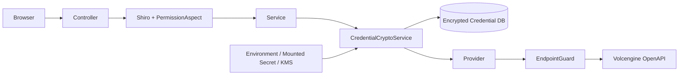

<!--
  Licensed to the Apache Software Foundation (ASF) under one
  or more contributor license agreements.  See the NOTICE file
  distributed with this work for additional information
  regarding copyright ownership.  The ASF licenses this file
  to you under the Apache License, Version 2.0 (the
  "License"); you may not use this file except in compliance
  with the License.  You may obtain a copy of the License at

    http://www.apache.org/licenses/LICENSE-2.0

  Unless required by applicable law or agreed to in writing,
  software distributed under the License is distributed on an
  "AS IS" BASIS, WITHOUT WARRANTIES OR CONDITIONS OF ANY
  KIND, either express or implied.  See the License for the
  specific language governing permissions and limitations
  under the License.
-->

# 云厂商托管 Flink 安全设计与威胁模型

## 1. 评审结论

状态：**技术方案完成，等待安全责任人批准。**

阻止进入 Cloud Account 正式开发的事项：

1. 确认生产主密钥来源。
2. 确认最小 IAM Action 和资源范围。
3. 确认是否允许自定义 Endpoint。
4. 确认密钥轮换和应急吊销流程。

## 2. 资产和信任边界

敏感资产：

- 云 Access Key、Secret Key、Session Token。
- 云项目、资源池、草稿、作业和快照标识。
- SQL、JAR、依赖和启动参数。
- Provider requestId、错误响应和控制台 URL；URL 查询参数可能包含短期访问令牌。

信任边界：



浏览器、数据库、日志系统和 Provider SDK 均不得获得长期明文 SK。

## 3. 威胁清单

| ID | 威胁 | 影响 | 控制 |
| --- | --- | --- | --- |
| T-01 | 数据库泄露导致 AK/SK 泄露 | 极高 | AES-GCM、外部主密钥、AAD |
| T-02 | 普通 Team 枚举或使用其他 Team 凭证 | 极高 | 显式 grant、后端资源校验 |
| T-03 | 自定义 Endpoint 导致 SSRF/凭证外发 | 极高 | 官方域名默认、allowlist、DNS/IP 校验 |
| T-04 | SDK debug/异常输出签名或密钥 | 极高 | 日志过滤、禁止 debug body/header |
| T-05 | 更新表单把掩码当作新 AK | 高 | 独立 write DTO、空值表示不轮换 |
| T-06 | 密钥轮换中断正在执行的操作 | 高 | credential version、测试后原子切换 |
| T-07 | 默认凭证链命中宿主机凭证 | 极高 | 显式 Credentials，禁用默认发现 |
| T-08 | 重放请求重复创建/启停作业 | 高 | Operation、幂等键、状态对账 |
| T-09 | 上传恶意或超大 JAR | 高 | 类型/大小/checksum/权限/隔离目录 |
| T-10 | 控制台 URL 开放重定向 | 中高 | Provider 生成 URL、host allowlist |
| T-11 | 错误详情泄露 SQL 变量或参数 | 高 | allowlist 错误 DTO、字段级脱敏 |
| T-12 | 停用账号后仍能从 client cache 调用 | 高 | credential version 进入 cache key、停用失效 |
| T-13 | 完整控制台/REST URL 中的短期令牌被持久化或写入日志 | 极高 | 丢弃 query/fragment、仅保存受信 host 与资源标识、按需生成跳转链接 |

只读实测确认，云侧作业详情可能同时返回基础 REST 地址和携带短期访问令牌的完整地址。
Provider 适配层必须把完整地址视为敏感凭证，而不是普通展示字段：

1. 禁止把完整地址写入数据库、Operation 结果、审计日志、异常或指标标签。
2. DTO、`toString()`、HTTP access log 和 SDK debug log 必须对 URL query/fragment 整体删除。
3. 数据库最多保存经过 allowlist 校验的 `scheme + host + port + path`，优先仅保存外部资源 ID。
4. UI 跳转链接由后端按需获取或生成，使用短 TTL，并通过 302 跳转，响应设置
   `Cache-Control: no-store` 和 `Referrer-Policy: no-referrer`。
5. 前端不得把该链接写入 localStorage、埋点参数或错误上报。

## 4. 凭证加密协议

### 4.1 密文格式

使用版本化 JSON envelope，数据库字段保存 Base64 编码后的完整 envelope：

```json
{
  "v": 1,
  "alg": "AES-256-GCM",
  "kid": "managed-flink-key-2026-01",
  "iv": "<base64-12-bytes>",
  "ciphertext": "<base64>",
  "tagBits": 128
}
```

要求：

- 每个字段、每次加密生成独立 96-bit 随机 IV。
- 禁止重复使用同一 key+IV。
- AES key 必须为 256 bit；若运行环境加密策略不支持，启动失败而不是降级。
- 不实现 ECB、CBC 或无认证加密回退。

### 4.2 AAD

```text
streampark
|managed-flink
|schema-v1
|providerType
|cloudAccountId
|fieldName
```

对新记录，需要先生成 accountId，再加密 AK/SK。AAD 防止密文跨账号或 AK/SK 字段串换。

### 4.3 KeyProvider

接口：

```java
public interface CredentialMasterKeyProvider {
    SecretKey getEncryptKey();
    SecretKey getDecryptKey(String keyId);
    String currentKeyId();
}
```

首期允许：

1. 环境变量引用的外部 Secret。
2. 只读挂载文件。
3. 企业 KMS adapter。

禁止：

- 代码默认密钥。
- 数据库保存主密钥。
- 把真实密钥放入配置示例或 Git。
- 记录 key material。

启动策略：

- feature flag 关闭：允许无主密钥启动。
- feature flag 开启：主密钥缺失、长度错误或 keyId 重复时启动失败。
- 只有只读展示掩码不需要解密；所有 Provider 调用均需要有效 key。

## 5. 密钥轮换

### 5.1 Cloud Account 凭证轮换

1. 接收新的 AK/SK 到 write-only DTO。
2. 用新凭证执行只读连通性测试。
3. 使用当前主密钥加密新凭证，产生新的 `credential_version`。
4. 在同一数据库事务中切换 active version。
5. 使旧 Provider client cache 失效。
6. 保留旧密文一个短回滚窗口，窗口结束后安全删除。

测试失败时禁止更新 active version。

### 5.2 主密钥轮换

1. KeyProvider 同时提供 old/new key。
2. 新写入全部使用 new keyId。
3. 后台任务分页解密旧密文并使用 new key 重加密。
4. 每条记录通过乐观锁更新。
5. 校验全部记录可以使用 new key 解密。
6. 完成备份和回滚窗口后下线 old key。

重加密任务不得输出明文和完整密文。

## 6. RBAC 和 Team 隔离

功能权限使用 `@RequiresPermissions`，资源隔离使用 `@Permission` 或等价 service 检查。

| 操作 | 平台管理员 | Team 管理员 | 普通开发者 |
| --- | --- | --- | --- |
| 创建/轮换/删除 Cloud Account | 允许 | 禁止 | 禁止 |
| 授权 Cloud Account 给 Team | 允许 | 仅查看本 Team 授权 | 禁止 |
| 查看 Cloud Account | 全部脱敏记录 | 仅被授权记录 | 仅环境需要的名称/状态 |
| 测试凭证 | 允许 | 默认禁止 | 禁止 |
| 查询 metadata | 全部 | 被授权账号 | 被授权且具备 app 权限 |
| release/start/stop | 按 app 权限 | 按 app 权限 | 按 app 权限 |

每次生命周期操作都重新验证：

```text
app.team_id
-> managed environment
-> cloud account
-> cloud_account_team grant
-> cloud account enabled
-> credential version active
```

## 7. Endpoint 与 SSRF

默认仅允许 Provider 内置官方 HTTPS Endpoint。

如果允许自定义 Endpoint，校验顺序：

1. URI 必须为绝对 HTTPS。
2. 禁止 userinfo、fragment、非空 query 和非预期 path。
3. host 必须匹配服务器端 allowlist，不接受前端传入 allowlist。
4. 解析全部 A/AAAA 地址。
5. 默认拒绝 loopback、link-local、multicast、unspecified、私网和保留地址。
6. 连接前和重定向后重新校验解析结果。
7. 默认关闭重定向；如果开启，仅允许同 scheme+host+port。
8. 固定允许端口，默认 443。
9. TLS hostname verification 必须开启，禁止 trust-all。

私有化部署若确需私网 Endpoint，必须由部署管理员在服务器配置精确 CIDR 和 hostname，
不能通过业务 API 动态添加。

## 8. 最小 IAM

最终策略以真实 Spike 的 Action 日志为准。首期需要按两类身份拆分：

### 8.1 Metadata/连通性

只读 Action：

```text
List project/resource pool
List/Get application draft
List/Get application and instance
Get start methods/capability
List file resources
List savepoints
```

### 8.2 生命周期

写 Action：

```text
Create/Update application draft
Deploy application draft
Upload/register file resource
Add draft dependency
Start application instance
Cancel application instance
Create savepoint
Restart application when explicitly supported
```

原则：

- 资源范围限制到指定项目。
- 生产和测试使用不同凭证。
- 不授予项目、资源池和 IAM 管理权限。
- 首期不授予删除云作业和删除 Savepoint 权限。
- IAM deny/permission error 必须映射为 AUTHORIZATION，不自动重试。

## 9. JAR 和依赖安全

- 只允许 `.jar`，服务端同时验证文件签名头，不只信扩展名。
- 文件名规范化，禁止路径穿越。
- 计算 SHA-256，按环境+checksum 复用。
- 设置单文件、单应用和单账号大小上限。
- 默认 PRIVATE resource permission。
- 上传目录按 StreamPark 环境隔离。
- 不执行上传的 JAR，不在 Console JVM classpath 加载。
- 日志只记录 fileId、checksum 前缀和 size，不记录下载 URL 查询参数。
- 失败和孤儿资源进入延迟清理队列，不同步删除可能仍被云作业引用的资源。

## 10. 日志和错误脱敏

禁止字段：

```text
accessKey
secretKey
sessionToken
Authorization
X-Date signature
signedHeaders
raw request headers
full ciphertext
```

允许字段：

```text
cloudAccountId
provider
region
projectId
resourcePoolId
operationId
providerRequestId
action
latency
errorCategory
```

SDK exception 先转换为 allowlist DTO，再写操作记录和返回前端。原始 response body 只能在
经过结构化脱敏后进入受限调试日志。

## 11. 安全测试

- 密文随机性、篡改检测和 AAD 串换。
- 错 keyId、旧 key 和轮换中断恢复。
- 所有 read API 不返回密文和 SK。
- 掩码回写测试。
- Team 横向越权和 IDOR。
- Endpoint localhost、IPv6、DNS rebinding、重定向和私网 IP。
- SDK 默认凭证链禁用验证。
- HTTP timeout/exception 日志 secret scan。
- JAR 路径穿越、伪扩展名和大小边界。
- 重放 release/start/stop 不产生重复资源。

## 12. 安全评审签字项

| 项目 | 推荐结论 | 责任人 | 状态 |
| --- | --- | --- | --- |
| 主密钥来源和 keyId 管理 | 首期使用只读挂载 Secret；接口保留 KMS 扩展；禁止环境变量直接保存密钥值 | 安全/部署管理员 | 待确认 |
| Cloud Account 轮换和吊销 | 新凭证验证后原子切换；旧版本仅保留受控回滚窗口；停用立即清除 client cache | 产品/安全 | 待确认 |
| 火山最小 IAM 策略 | 仅授予已验证的项目内草稿、文件、作业和 Savepoint Action；不授予项目/IAM/资源池管理和删除权限 | 云管理员/安全 | 待补齐精确 Action 并确认 |
| 自定义 Endpoint 是否首期开放 | 首期关闭；私有化场景后续通过部署级 allowlist 单独启用 | 产品/安全 | 待确认 |
| SDK 默认凭证链禁用 | 显式注入 Cloud Account 凭证，不允许宿主机或 metadata 自动发现 | 后端 | 设计完成 |
| 日志和异常脱敏 | allowlist DTO；URL query/fragment、签名头、密文和密钥禁止落盘 | 后端/安全 | 设计完成 |
| JAR 上传边界 | 已验证 PRIVATE 小型 JAR；大小、伪扩展名和恶意内容边界纳入实现测试 | 后端/安全 | 部分完成 |

签字时不得只确认“整体方案”。每一项应记录确认人、日期和例外条件；任一例外扩大
凭证暴露面或 IAM 权限时，必须回到威胁模型增加对应控制和测试。
